# 1강. 서버가 대답하는 법

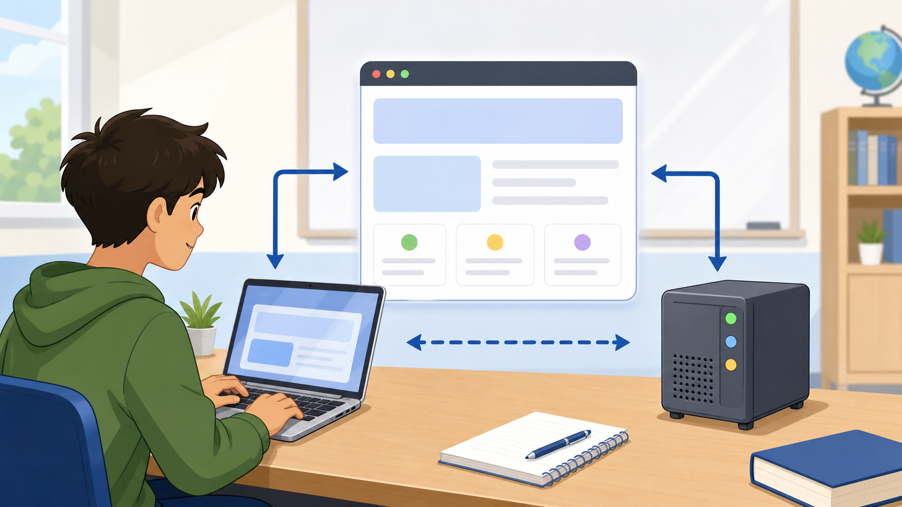

## 1장. 화면 앞에서 멈춘 첫날

키보드 소리만 또록또록 울리는 사무실이었습니다. 오픈이는 이번 주 월요일에 입사한 신입 백엔드 개발자입니다. 노트북을 펴고 사내 게시판 프로젝트를 내려받았습니다. 화면 오른쪽 아래에는 회사 로고가, 왼쪽에는 낯선 폴더 트리가 떠 있었습니다.

**동료**: "일단 실행부터 해볼래요? 요즘 이 프로젝트, 스프링 부트로 옮기는 중이라 저도 아직 헷갈리는 게 많아요."

오픈이는 안내받은 대로 실행 버튼을 눌렀습니다. 콘솔 창에 로그가 좌르륵 올라가고 잠시 후 커서가 깜빡이며 멈췄습니다. 브라우저를 열어 `localhost:8080`을 입력했더니 정말로 화면이 떴습니다.

*방금 내가 뭘 한 거지?*

분명히 자기 컴퓨터에서 실행 버튼 하나만 눌렀는데 브라우저에는 처음 보는 페이지가 나타났습니다. 오픈이는 그 화면을 한참 들여다보다가 팀장 자리로 갔습니다.

**오픈이**: "로컬에서 서버를 켰는데 왜 브라우저에서 화면이 보이나요? 저는 그냥 실행 버튼만 눌렀거든요."

**팀장**: "음, 그거 식당이랑 비슷하지 않아요? 손님이 주문하면 누가 그 주문을 받죠?"

오픈이는 잠깐 말이 막혔습니다. *주방장이 받나, 아니면 서빙하는 사람이 받나.* 처음에는 "그냥 컴퓨터 안에 파일이 저장돼 있어서 보이는 거 아니에요?"라고 대답했습니다. 팀장은 고개를 저었습니다.

**팀장**: "파일만 있으면 아무도 안 가져다줘요. 누군가는 주문을 받아서 확인하고 다시 내보내야죠."

그제야 오픈이 머릿속에 식당 풍경이 그려졌습니다. 손님이 주문서를 내밀면 주방이 메뉴를 확인하고 재료를 꺼내 조리한 다음 완성된 음식을 다시 내보냅니다. 지금 자기가 겪은 일도 비슷한 모양이었습니다. 브라우저가 손님이라면 방금 실행한 그 프로그램이 주방인 셈입니다.

**팀장**: "요즘은 전자정부 표준프레임워크 프로젝트도 이 실행 방식 위에서 돌아가요. 예전엔 화면 하나 그려주는 걸로 끝났는데, 지금은 API 서버, 클라우드 배포까지 다 이 구조를 전제로 하거든요. 그러니까 오늘 이거 제대로 잡고 가야 해요."

오픈이는 수첩에 세 문장을 적었습니다. 오늘 확인해야 할 것은 이렇습니다.

- 서버 프로그램이 요청을 받아 응답을 돌려주는 흐름을 설명할 수 있어야 한다.
- 웹 서버, WAS, 스프링 부트 실행 환경이 서로 뭐가 다른지 구분할 수 있어야 한다.
- `/hello`라는 가장 작은 주소에 직접 응답을 만들어 눈으로 확인해야 한다.

### 주문서를 받는 프로그램

서버 프로그램은 식당 주방과 같습니다. 손님이 주문서를 내면 주방은 메뉴를 확인하고, 재료를 꺼내 조리하고, 완성된 음식을 다시 내보냅니다. 서버 프로그램도 똑같습니다. 요청을 받고, 필요한 처리를 하고, 요청한 쪽이 이해할 수 있는 응답을 돌려줍니다.

여기서 요청은 사용자가 원하는 일입니다. "공지사항 목록을 보여 주세요", "회원 정보를 저장해 주세요" 같은 것이 모두 요청입니다. 서버 프로그램은 이 요청을 해석하고 필요하면 데이터베이스와도 이야기한 뒤 결과를 응답으로 돌려줍니다.

식당에 빗대면 손님은 브라우저이고, 주문서는 HTTP 요청이고, 주방은 서버 프로그램이고, 완성된 음식은 HTTP 응답입니다. 앞으로 배울 Controller, Service, Repository 코드는 모두 이 주방 안에서 각자 맡은 일을 하는 구성원이라고 보면 됩니다.


서버가 항상 화면만 그려준다고 생각하면 곤란합니다. 어떤 서버는 HTML을 만들어 주지만 어떤 서버는 JSON 데이터를 돌려주고 어떤 서버는 파일을 내려주거나 저장 작업을 수행합니다. 공통점은 요청을 받아 어떤 일을 하고 응답을 만든다는 점입니다. "누가 요청했는가, 누가 처리했는가, 무엇을 돌려주었는가." 이 세 질문이 서버 프로그램을 설명하는 기본 뼈대입니다.

## 2장. 약속이 있어야 대화가 된다

오픈이는 자리로 돌아와 브라우저 개발자 도구를 처음 열어봤습니다. Network 탭에는 이해할 수 없는 줄이 잔뜩 나열돼 있었습니다. `GET`, `200`, `/hello` 같은 글자들이 눈에 들어왔습니다.

**동료**: "그거요, 저번 주에 저도 그것 때문에 삽질했어요. API가 안 된다길래 한참 코드를 뒤졌는데, 알고 보니 주소를 `/helo`라고 한 글자 빼먹고 쳤더라고요."

오픈이는 웃음이 났습니다. *그럼 컴퓨터도 주소가 틀리면 못 알아듣는다는 거네.* 손으로는 웃었지만 속으로는 찔렸습니다. 방금 전 자기도 주소창에 대충 아무거나 입력했다가 아무 반응이 없어서 당황했던 참이었습니다.

브라우저와 서버가 아무 규칙 없이 대화하면 서로 알아들을 수 없습니다. 그래서 웹에서는 HTTP라는 약속을 씁니다. 이 약속은 택배 운송장과 비슷합니다. 보내는 사람, 받는 곳, 요청 내용이 정해진 칸에 적혀 있어야 물건이 제대로 이동합니다. 주소가 틀리면 택배가 엉뚱한 곳으로 가듯 HTTP 경로나 메서드가 틀리면 서버도 원하는 코드를 찾지 못합니다.

### 요청과 응답, 그리고 그 안의 구조

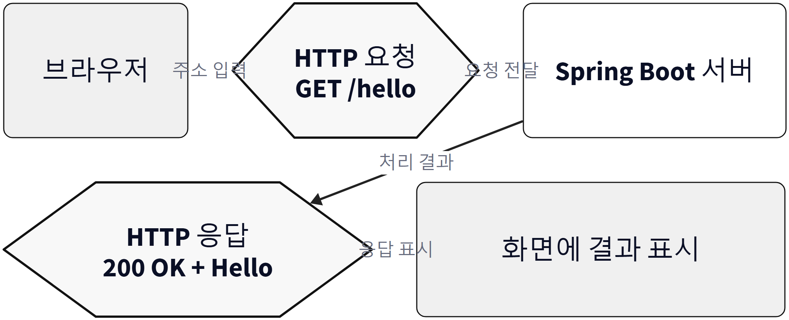

HTTP 요청은 브라우저가 서버에 보내는 메시지입니다. `GET /hello`는 `/hello`라는 자원을 가져오고 싶다는 뜻입니다. 서버는 요청을 처리한 뒤 응답을 돌려줍니다. 응답에는 성공 여부를 나타내는 상태 코드가 들어갑니다. `200 OK`는 요청이 성공했다는 뜻입니다.

요청과 응답은 회사 결재 양식과도 닮았습니다. 결재 제목, 담당자, 첨부 내용, 승인 결과가 정해진 칸에 들어가야 다음 사람이 바로 이해할 수 있습니다. HTTP 메시지도 마찬가지로 시작 줄, 헤더, 빈 줄, 본문이라는 정해진 구조를 가집니다.

```http
GET /hello HTTP/1.1
Host: localhost:8080
```

```http
HTTP/1.1 200 OK
Content-Type: text/plain

Hello Spring Boot
```

요청 메시지에는 어떤 방식으로 요청하는지, 어느 경로를 요청하는지가 담깁니다. 응답 메시지에는 성공인지 실패인지 알려주는 상태 코드와 실제 응답 내용이 담깁니다. 초급 단계에서는 모든 헤더를 외울 필요는 없습니다. 요청에는 목적지가 있고 응답에는 처리 결과가 있다는 구조만 먼저 잡아두면 됩니다.

브라우저 개발자 도구의 Network 탭을 보면 요청 URL, 메서드, 상태 코드, 응답 본문을 확인할 수 있습니다. 방향은 항상 정해져 있습니다. 브라우저가 먼저 보내고, 서버가 나중에 돌려줍니다. 이 방향을 기억해 두면 나중에 Controller 코드가 어디에 놓이는지 훨씬 쉽게 이해됩니다.

## 3장. 안내 데스크와 주방

며칠 뒤, 동료가 모니터를 붙잡고 한숨을 쉬고 있었습니다.

**동료**: "로고 이미지 하나 바꿨는데 왜 서버 전체를 다시 배포해야 하죠? 이건 그냥 파일 아니에요?"

**팀장**: "그거랑 로그인 처리랑 같은 자리에서 일어나는 일이라고 생각해요?"

동료는 잠깐 멈칫했습니다. 오픈이도 옆에서 듣다가 *이미지 파일이랑 로그인이 다른 일이라는 건가* 하고 생각했습니다. 팀장은 짧게 덧붙였습니다.

**팀장**: "매장 입구에 안내 직원 있잖아요. 메뉴판 달라면 바로 꺼내주죠. 근데 손님이 주문 변경해달라고 하면요?"

**오픈이**: "그건 안내 직원이 아니라 담당 부서로 넘겨야죠."

**팀장**: "맞아요. 그 담당 부서가 하는 일이 지금 얘기하는 그거예요."

### 정적인 것과 동적인 것

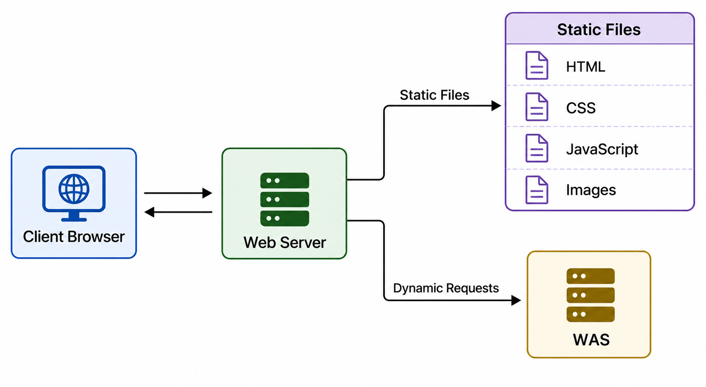

웹 서버는 매장 입구의 안내 직원과 같습니다. 메뉴판, 안내 책자, 번호표처럼 이미 준비된 것은 바로 꺼내 줄 수 있습니다. 하지만 손님별 상담이나 주문 변경처럼 판단이 필요한 일은 담당 부서나 주방으로 넘깁니다.

정리하면 웹 서버는 HTML, CSS, JavaScript, 이미지 같은 정적 리소스를 빠르게 제공하거나 필요한 요청을 다른 서버로 전달하는 서버입니다. 정적 파일은 요청이 들어올 때마다 복잡한 계산을 하지 않아도 되는 리소스입니다. 회사 로고 이미지, CSS 파일, JavaScript 파일이 여기에 속합니다.

WAS는 Web Application Server의 줄임말입니다. 여기서는 단순히 파일을 전달하는 수준을 넘어 애플리케이션 코드가 실제로 동작합니다. 로그인, 게시글 등록, 주문 처리, 데이터베이스 조회처럼 요청마다 결과가 달라지는 일을 처리합니다. WAS는 식당의 주방장과 조리팀에 가깝습니다. 메뉴판은 안내 직원이 줄 수 있지만 손님별 주문을 실제로 조리하려면 주방이 움직여야 합니다.

"내 장바구니 보기" 같은 요청은 사용자마다 결과가 다릅니다. 단순 파일 전달이 아니라 로그인 사용자 확인, 장바구니 데이터 조회, 응답 생성이 필요하므로 애플리케이션 로직이 실행되어야 합니다. 구분하는 기준은 단순합니다. 요청마다 판단이 필요한가. 로그인 여부, 재고 수량, 게시글 목록처럼 매번 결과가 달라질 수 있는 요청은 WAS의 영역입니다.

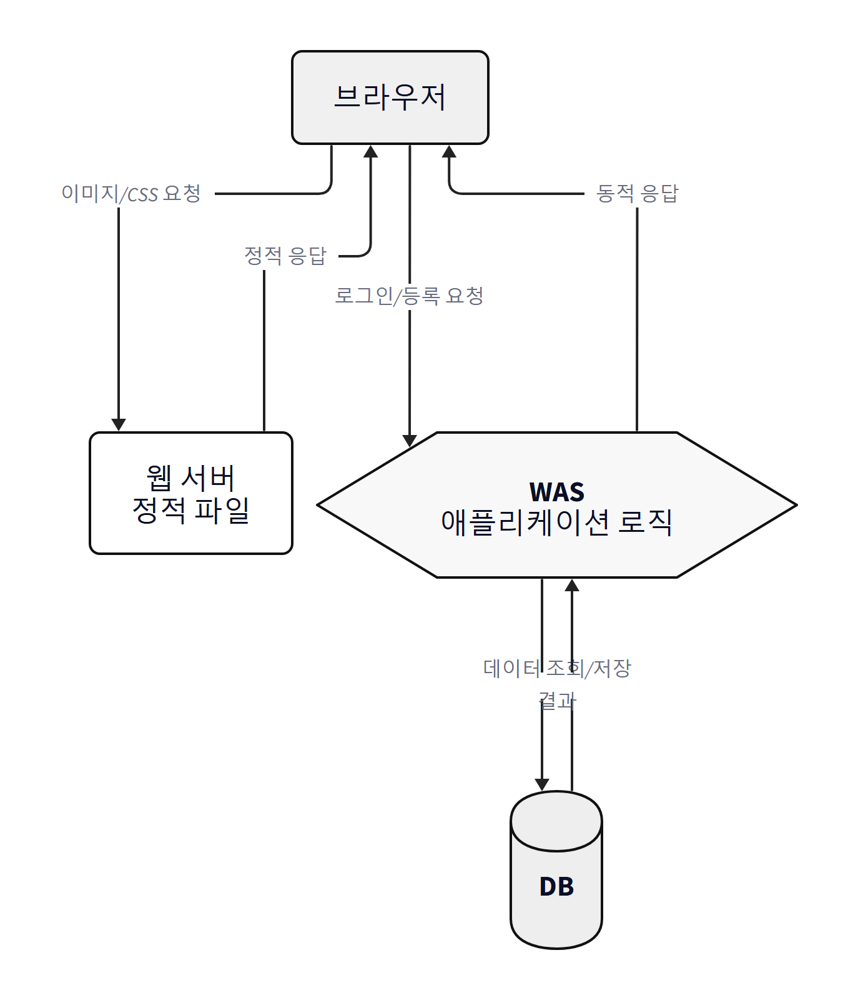

동료는 로고 이미지 하나 바꾼 걸로 서버를 통째로 다시 배포한 게 아니라, 배포 설정 자체가 정적 리소스와 동적 로직을 함께 묶어 두고 있었다는 걸 그제야 알아챘습니다.

**동료**: "아, 그러니까 이미지는 원래 안내 데스크가 처리할 일이었는데, 저희 프로젝트는 그 구분이 안 돼 있었던 거네요."

## 4장. 공연장을 빌리던 시절

퇴근 전, 팀장이 커피를 내리며 옛날이야기를 꺼냈습니다.

**팀장**: "나 예전에는 새 프로젝트 받으면 반나절은 그냥 서버 설치하다 갔어요. Tomcat 버전 맞추고, 포트 맞추고, 배포 경로 맞추고. 그러다 누구는 되고 누구는 안 되고, 원인 찾다가 하루가 갔죠."

오픈이는 그 이야기를 들으며 *지금은 그럼 안 그런가* 하고 물었습니다. 팀장은 웃으며 답했습니다.

**팀장**: "공연장 빌려서 그 위에 공연팀 올리는 거랑 비슷했어요. 공연팀이 아무리 준비돼 있어도 전기, 조명, 입장 동선이 안 맞으면 공연을 못 열잖아요. 외부 Tomcat 설정이 그런 식이었어요."

전통적인 방식에서는 Tomcat 같은 서버를 따로 설치하고, 만든 애플리케이션을 WAR 파일로 묶어 그 서버에 배포하는 흐름이 많았습니다. 지금도 쓸 수 있는 방식이지만 처음 배우는 사람에게는 설정할 것이 너무 많습니다. Tomcat 버전, 포트, 배포 경로, 서버 설정이 다 맞아야 합니다. 그래서 개발 환경이 조금만 달라도 "내 PC에서는 되는데 다른 PC에서는 안 된다"는 문제가 생기기 쉬웠습니다.

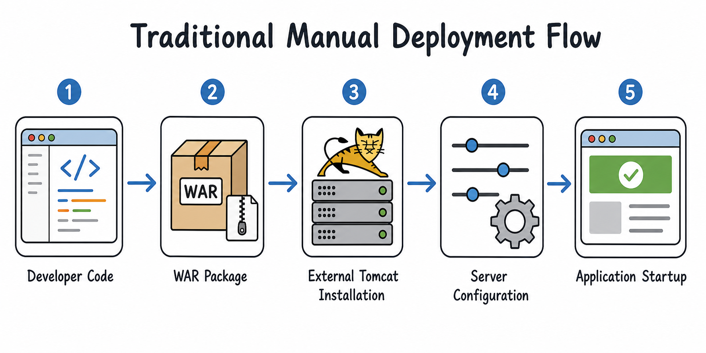

**동료**: "저도 입사 첫 주에 그거 반나절 날렸잖아요. 옆자리 선배가 `Run As > Spring Boot App`만 눌러보라고 해서 눌렀더니 그냥 8080 포트가 떴어요. 허무할 정도였다니까요."

*허무할 정도로 쉬웠다니, 그럼 예전엔 대체 뭘 그렇게 오래 했던 거지.*


### 가게를 통째로 싣고 다니는 방법

스프링 부트 방식은 푸드트럭과 같습니다. 주방을 따로 빌리지 않고 조리 장비를 차 안에 싣고 이동하므로 자리를 잡으면 바로 영업을 시작할 수 있습니다. 애플리케이션도 실행 파일 안에 필요한 서버 환경을 품고 출발합니다.

`main()` 메서드가 `SpringApplication.run()`을 호출하면 Spring 애플리케이션이 시작됩니다. 웹 애플리케이션에 필요한 의존성이 들어 있으면 Spring Boot가 웹 애플리케이션이라고 판단하고 내장 Tomcat을 함께 시작합니다. 그래서 개발자는 외부 Tomcat을 따로 설치하지 않아도 `localhost:8080`으로 접속해 결과를 확인할 수 있습니다. 여기서 외부 Tomcat이 완전히 사라졌다고 이해하면 안 됩니다. 핵심은 Tomcat이 애플리케이션 안에 포함되어 함께 시작된다는 점입니다.

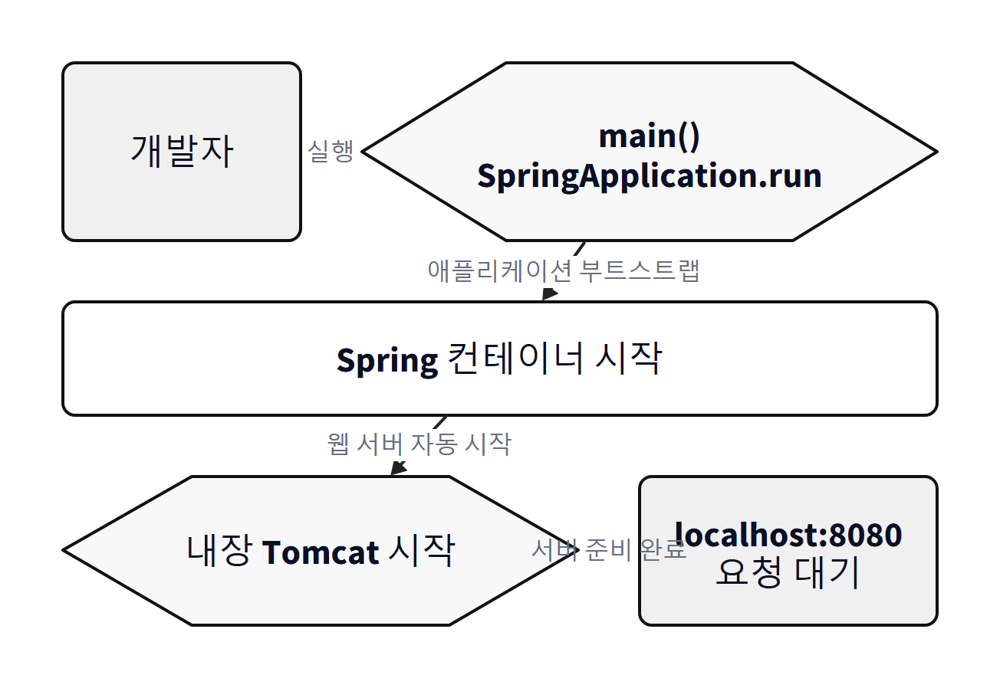

그런데 내장 서버가 뜨는 것만으로는 부족합니다. 무엇을 실행할지도 알아야 합니다. 이 부분을 채워주는 것이 자동 설정입니다. 자동 설정은 캠핑 초보를 돕는 캠핑 매니저와 같습니다. 텐트가 있으면 팩과 망치를 챙기고, 버너가 있으면 가스와 조리대를 준비해 줍니다. 개발자가 모든 장비 목록을 처음부터 직접 적지 않아도 기본 구성이 갖춰지는 느낌입니다.

자동 설정은 프로젝트의 의존성과 상황을 보고 "이 프로젝트는 웹 애플리케이션이겠구나", "그러면 Spring MVC와 Tomcat 구성이 필요하겠구나"처럼 기본 구성을 잡아주는 기능입니다. `spring-boot-starter-webmvc`를 추가하면 웹 애플리케이션에 필요한 기본 구성이 자동으로 잡힙니다. 개발자는 처음에는 기본값을 이용해 빠르게 시작하고, 나중에 필요해지면 설정을 바꾸면 됩니다.

**동료**: "그러니까 저희가 지금 손댈 건 서버 설정이 아니라 코드 그 자체네요."

**팀장**: "그렇죠. 조립식 가구 살 때 공구가 같이 들어 있으면 시작이 훨씬 쉽잖아요. 스프링 부트도 그래요."

## 5장. 물 한 잔부터 켜보기

퇴근 시간이 다 됐지만 오픈이는 자리에 남았습니다. *오늘 배운 걸 내 손으로 한 번 확인해보고 싶다.* 노트북 화면에는 STS4가 떠 있었습니다.

**팀장**: "처음 식당 열 때 모든 메뉴를 다 만들 필요는 없어요. 물 한 잔 주문 받아서 제대로 내보내는지부터 확인하면 되죠."

오늘 만들 것은 `/hello`라는 주소로 요청이 들어오면 `Hello Spring Boot`라는 문자열을 응답하는, 아주 작은 서버 프로그램입니다. 기능은 단순하지만 프로젝트 생성, 의존성, Controller, 실행, 브라우저 확인이 모두 연결되어야 성공합니다.

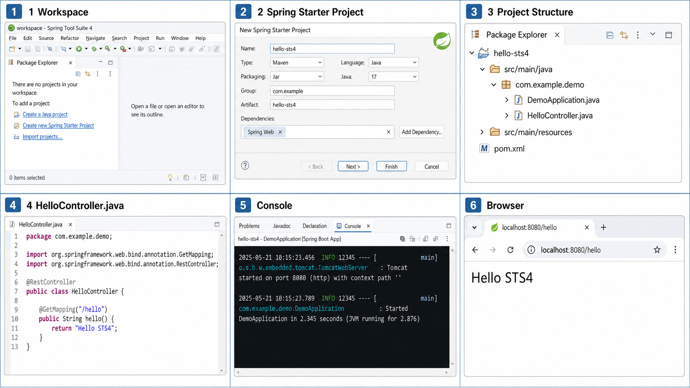

### 실습 1. 프로젝트 계약하기

프로젝트 생성은 빈 가게를 계약하고 업종을 정하는 단계입니다. 라면 가게인지 카페인지 정하면 필요한 기본 설비가 달라지듯 무엇을 만들지 먼저 정해야 합니다.

STS4에서 `File > New > Spring Starter Project`를 선택했습니다.

- Name: `ch01-hello-server`
- Type: Gradle - Groovy
- Spring Boot: 4.1.0
- Java: 21
- Packaging: Jar
- Package: `com.example.ch01`

### 실습 2. 웹 요청을 받을 세트 챙기기

라면 가게를 시작한다고 하면 냄비, 버너, 물, 그릇이 세트로 필요합니다. Web MVC 스타터는 웹 요청을 처리하기 위한 기본 세트입니다. Dependencies 화면에서 `Spring Web MVC`를 선택했습니다.

`spring-boot-starter-webmvc`가 들어가면 프로젝트 안에 웹 요청을 처리하는 데 필요한 Spring MVC와 내장 Tomcat 관련 라이브러리가 함께 들어옵니다. Spring Boot는 클래스패스에 어떤 라이브러리가 있는지 보고 기본 설정을 추정합니다. 이 스타터가 있으면 "이 프로젝트는 MVC 웹 애플리케이션이겠구나"라고 판단하고 Spring MVC와 내장 Tomcat 구성을 준비합니다.

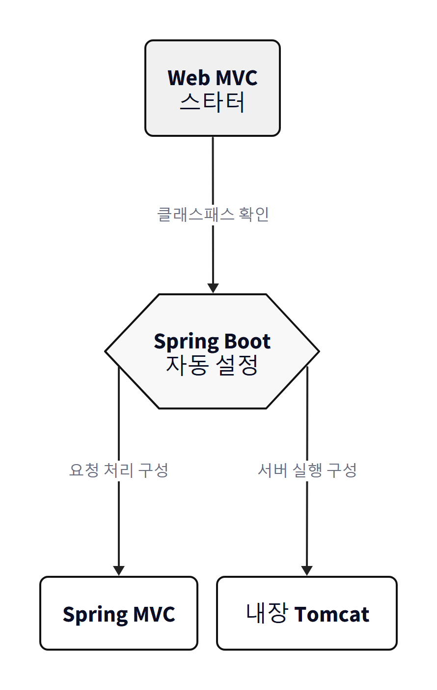

### 실습 3. 주문 접수 담당자 만들기

Controller는 식당의 주문 접수 담당자입니다. 손님이 `/hello`라는 주문을 하면 담당자는 그 주문을 받을 수 있는지 확인하고 정해진 응답을 준비합니다. 주문 창구가 없으면 손님은 주방에 요청을 전달할 방법이 없습니다.

`src/main/java/com/example/ch01/HelloController.java`를 새로 만들고 아래 코드를 입력했습니다.

```java
package com.example.ch01;

import org.springframework.web.bind.annotation.GetMapping;
import org.springframework.web.bind.annotation.RestController;

@RestController
public class HelloController {

    @GetMapping("/hello")
    public String hello() {
        return "Hello Spring Boot";
    }
}
```

이 코드에서 눈여겨봐야 할 곳은 세 군데입니다. `@RestController`는 이 클래스가 웹 요청을 처리하는 창구라는 표시입니다. `@GetMapping("/hello")`는 `/hello`라는 주소로 들어오는 GET 요청을 이 메서드로 연결한다는 뜻입니다. 반환된 문자열은 별도 화면 템플릿으로 가지 않고 응답 본문에 바로 담겨 브라우저로 전달됩니다.

### 실습 4. 전원 스위치 누르기

`main()`은 가게의 전원 스위치입니다. 스위치를 켜면 조명만 켜지는 것이 아니라 냉장고, 주방 장비, 주문 접수 시스템도 차례로 준비됩니다. 프로젝트를 생성할 때 이미 만들어진 시작 클래스를 열어보니 이런 코드가 있었습니다.

```java
package com.example.ch01;

import org.springframework.boot.SpringApplication;
import org.springframework.boot.autoconfigure.SpringBootApplication;

@SpringBootApplication
public class Ch01HelloServerApplication {

    public static void main(String[] args) {
        SpringApplication.run(Ch01HelloServerApplication.class, args);
    }
}
```

`main()` 안에서 서버를 하나하나 직접 만드는 것이 아니라 `SpringApplication.run()`을 호출합니다. 이 한 줄이 Spring Boot 애플리케이션 시작의 핵심입니다. Spring 컨테이너가 시작되고, 필요한 Bean이 준비되고, 웹 애플리케이션이면 내장 Tomcat도 시작됩니다. Controller는 요청이 왔을 때 실행되는 코드이고, `main()`은 요청을 받기 전 실행 환경을 먼저 켜는 코드입니다. 이 순서를 알아두면 실행 오류와 요청 오류를 구분할 수 있습니다.

### 실행, 그리고 두 번의 멈춤

오픈이는 프로젝트를 우클릭하고 `Run As > Spring Boot App`을 눌렀습니다. 콘솔에 로그가 쏟아졌습니다.

시도 1: 실행 버튼을 누르자마자 콘솔이 빨간 글씨로 멈췄습니다. `Port 8080 was already in use`라는 문장이 보였습니다.

*뭐지, 나는 아무것도 안 열었는데.*

동료 자리로 가서 물어보니 낮에 실행해 둔 다른 프로젝트가 아직 8080 포트를 붙잡고 있었습니다. 그 프로젝트를 종료하고 다시 실행 버튼을 눌렀습니다.

시도 2: 이번에는 콘솔에 `Started` 로그가 뜨고 `Tomcat started on port 8080`이라는 문장도 보였습니다. 브라우저를 열어 주소창에 `http://localhost:8080/helo`라고 입력했습니다. 화면에는 흰 페이지에 짧은 오류 문구만 나타났습니다.

**동료**: "그거 아까 저도 그랬다니까요. 주소 한 글자 확인해봐요."

오픈이는 주소창을 다시 들여다봤습니다. `/helo`. l이 하나 빠져 있었습니다. `/hello`로 고쳐 다시 입력했습니다.

화면에 `Hello Spring Boot`라는 글자가 떴습니다.

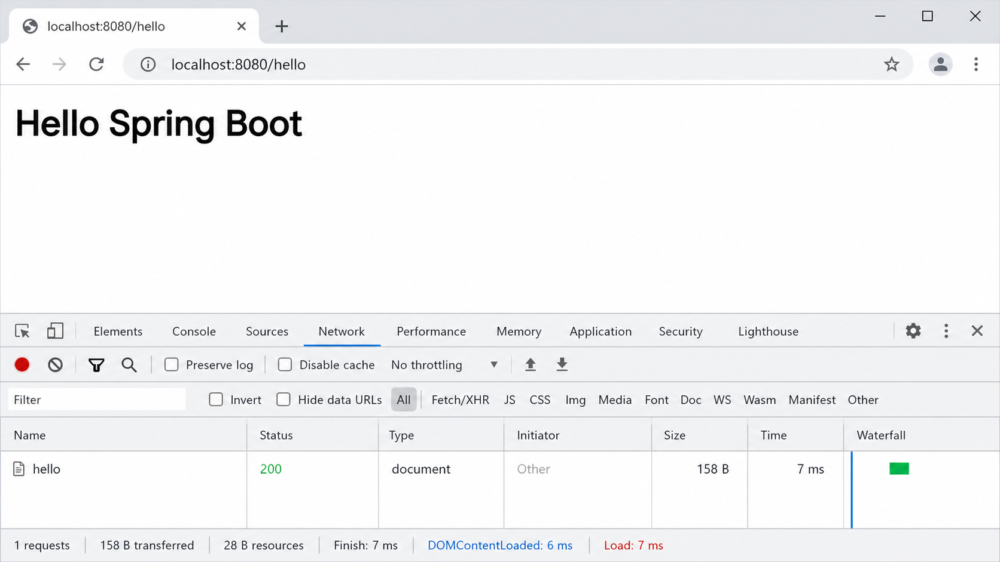

**동료**: "이제 진짜 요청이 오가는 거네요."

`localhost:8080/hello`는 우리 PC 안에 열린 작은 가게의 주소와 메뉴명입니다. `localhost`는 이 건물이고, `8080`은 출입문 번호이고, `/hello`는 주문할 메뉴라고 생각하면 됩니다. 셋 중 하나라도 틀리면 원하는 응답을 받을 수 없습니다. 브라우저는 이 주소를 바탕으로 HTTP 요청을 만들고, 그 요청은 실행 중인 Spring Boot 애플리케이션으로 전달됩니다. Spring Boot는 `/hello` 경로를 처리할 Controller 메서드를 찾고, `hello()` 메서드를 실행한 결과인 문자열이 응답으로 돌아옵니다.

## 6장. 요청이 도착하기까지

퇴근길, 오픈이는 오늘 겪은 일을 하나의 그림으로 다시 그려봤습니다. 브라우저에서 `/hello` 요청이 만들어지면 내장 Tomcat이 그 요청을 받습니다. Tomcat은 웹 서버 역할을 하면서 요청을 Spring MVC 쪽으로 넘깁니다. Spring MVC는 등록된 Controller와 매핑 정보를 보고 `/hello`를 처리할 메서드를 찾습니다. `HelloController`의 `hello()` 메서드가 실행되고, 반환된 문자열이 HTTP 응답으로 브라우저에 돌아갑니다.

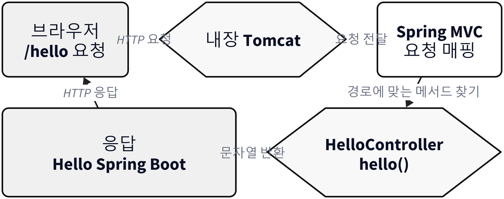

브라우저 → 내장 Tomcat → Spring MVC 요청 매핑 → `HelloController.hello()` → HTTP 응답.

이 그림은 앞으로 계속 확장됩니다. 나중에는 Controller 뒤에 Service가 붙고, Repository와 데이터베이스가 붙습니다. 하지만 출발점은 오늘 본 이 흐름입니다. 오늘 직접 작성한 코드는 Controller뿐이고, 나머지는 요청을 받아 Controller까지 연결해주는 실행 환경입니다.

### 어디부터 볼까

택배가 안 왔다고 바로 택배기사를 탓하지는 않습니다. 먼저 물류센터에서 출발했는지, 주소가 맞는지, 수령인이 있는지 차례로 확인합니다. 서버가 화면에 안 보일 때도 감이 아니라 순서로 좁혀가면 됩니다.

1. 서버가 실제로 실행되었는지 확인합니다. 콘솔에 Started 메시지가 없거나 오류가 있다면 요청을 받을 수 없습니다.
2. URL이 맞는지 확인합니다. 포트가 다르거나 경로가 틀리면 원하는 Controller까지 요청이 가지 않습니다.
3. Controller 코드의 매핑이 맞는지 확인합니다. `@GetMapping("/hello")`가 아니라 다른 경로로 되어 있으면 404가 날 수 있습니다.

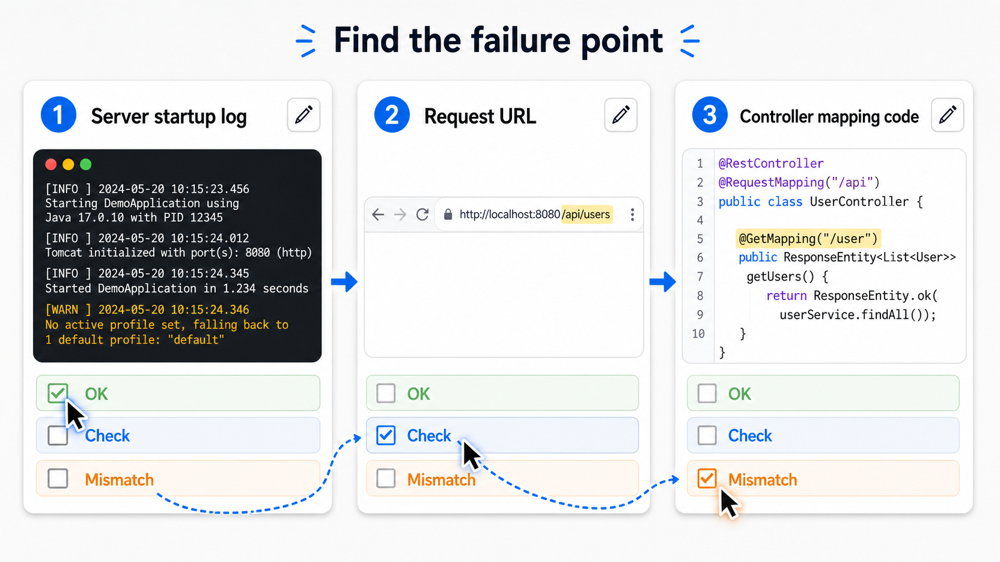

서버가 켜지지 않았는데 URL만 고치고 있으면 시간이 낭비됩니다. 반대로 서버가 정상인데 주소가 틀렸다면 코드 전체를 의심할 필요가 없습니다. 실행 로그, URL, Controller 매핑 순서만 잡아도 초급 단계의 많은 오류를 해결할 수 있습니다. 오늘 오픈이가 겪은 두 번의 멈춤도 정확히 이 순서 안에 있었습니다. 첫 번째는 실행 단계, 두 번째는 URL 단계였습니다.

### 확인 문제

**문제 1.** Spring Boot 웹 애플리케이션을 실행했을 때 내장 Tomcat이 시작되는 이유로 가장 적절한 것은 무엇일까요.

1. 브라우저가 자동으로 Tomcat을 설치하기 때문이다.
2. Web MVC 스타터와 자동 설정을 바탕으로 Spring Boot가 웹 애플리케이션 실행 환경을 구성하기 때문이다.
3. 모든 Java 프로그램은 기본적으로 8080 포트를 열기 때문이다.
4. Controller 클래스가 데이터베이스를 자동으로 생성하기 때문이다.

정답은 2번입니다. Spring Boot는 프로젝트의 의존성과 자동 설정을 바탕으로 필요한 실행 환경을 구성합니다. Web MVC 스타터가 있으면 웹 애플리케이션으로 판단하고 내장 Tomcat과 Spring MVC 구성을 준비합니다. 브라우저가 Tomcat을 설치하는 것도 아니고, 모든 Java 프로그램이 8080 포트를 여는 것도 아닙니다. 데이터베이스 자동 생성과는 더더욱 관계가 없습니다.

**문제 2.** HTTP에서 브라우저가 서버에 보내는 메시지를 요청(Request), 서버가 브라우저로 돌려주는 메시지를 응답(Response)이라고 한다. (O/X)

정답은 O입니다. 클라이언트, 보통은 브라우저가 서버에 보내는 메시지를 요청이라 하고, 서버가 그 요청에 대해 돌려주는 메시지를 응답이라 합니다. 앞으로 REST API를 만들 때도 이 요청과 응답을 계속 설계하게 됩니다.

**문제 3.** 웹 서버는 항상 데이터베이스 조회와 비즈니스 로직 실행을 직접 담당하며, WAS는 정적 파일만 전달한다. (O/X)

정답은 X입니다. 일반적으로 웹 서버는 정적 리소스 전달에 강하고, WAS는 애플리케이션 로직을 실행하는 역할을 담당합니다. 실제 시스템에서는 구성 방식에 따라 역할이 섞일 수 있지만, 기초 개념에서는 정적 리소스 중심의 웹 서버와 동적 로직 중심의 WAS를 먼저 나누어 이해하는 편이 좋습니다.

### 이것만은 기억하자

- 서버 프로그램은 요청을 받고, 처리하고, 응답을 돌려주는 주방이다.
- 웹 서버는 안내 데스크, WAS는 주방장과 조리팀이다.
- 스프링 부트는 주방 설비를 통째로 싣고 다니는 푸드트럭이다.
- 다음 시간에는 이 주방 안에 Controller와 함께 Service, Repository라는 새 구성원이 들어온다.

### 지도를 다시 펴보며

오늘 확인한 내용은 다음 자료를 근거로 삼았습니다. 실무에서는 기억보다 공식 문서를 기준으로 판단합니다. 프레임워크는 버전이 바뀌면 요구사항과 권장 방식도 함께 바뀌기 때문입니다.

- Spring Boot 공식 문서 (https://docs.spring.io/spring-boot/index.html)
- Spring Boot 4.1.0 시스템 요구사항 (https://docs.spring.io/spring-boot/system-requirements.html)
- Spring Boot 첫 애플리케이션 튜토리얼 (https://docs.spring.io/spring-boot/tutorial/first-application/index.html)
- Spring Tools 공식 페이지 (https://spring.io/tools/)
- MDN HTTP Overview (https://developer.mozilla.org/en-US/docs/Web/HTTP/Guides/Overview)
- 전자정부 표준프레임워크 v5.0.0 버전 안내 (https://www.egovframe.go.kr/home/ntt/nttRead.do?bbsId=6&menuNo=74&nttId=1940)
- eGovFrame 심플홈페이지 BackEnd GitHub (https://github.com/eGovFramework/egovframe-template-simple-backend)
