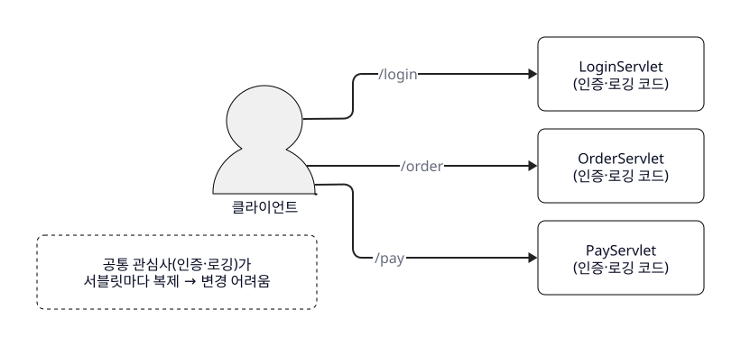
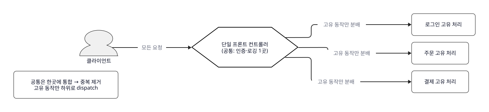
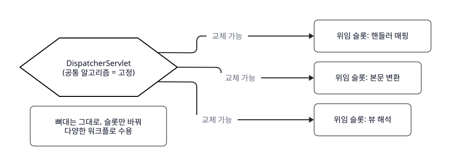
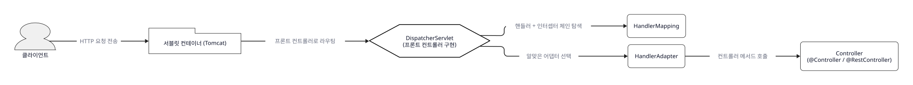
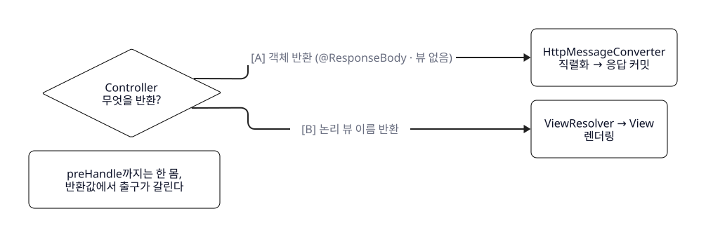

<!--
lesson_id: L01
course: spring-mvc-2026
delivery_type: filmed
lesson_mode: THEORY
duration: 14분 (촬영 기준) = 파트1 이론 4분 + 파트2 시뮬 조작 10분
episode: 1
learning_goal: HTTP 요청이 Spring MVC 내부에서 처리되는 흐름을 설명할 수 있다. (ref 0)
central_metaphor: 건물 정문의 안내데스크(단일 접수처)
simulator: simulators/시뮬레이터_MVC요청흐름.html (모드 A=@RestController STEP 0~10, 모드 B=@Controller STEP 0~12)
central_thread: 회원가입 요청 POST /members 한 건의 왕복 (L03에서 직접 구현할 요청)
climax: 모드 A STEP 8~9 — "응답이 언제 만들어지고 언제 커밋되는가" (postHandle 이전 커밋)
supersedes: [구 L01 (이론 서사), 구 L02 (시뮬 조작 서사)]  # v1.7 레슨 재편으로 통합
used_claims: [C-01, C-02, C-03, C-04, C-05, C-15, C-17, C-18, S-01, S-02, S-03, S-04, S-05, S-06, S-07, C-07, S-08, S-09, S-10, S-11, S-12, S-14, S-15, S-16]
excluded_claims: [V-01, V-02]  # unverified — Jackson 자동구성/ThemeResolver 제거 시점 원고 제외
book_format: v1.8  # 원고=책. [IMAGE PROMPT] 1개(l01-dispatcher-desk) + d2 5블록(l01-d1~d5, SVG 병기) + 섹션별 예시/비유·시각요소 보강. 발화 자수 밴드 3,500~4,200 유지(상계 압축 반영).
-->

# L01 — Spring MVC는 요청을 왜 DispatcherServlet에 몰아주는가 (흐름 추적까지)

---

## 파트 1 — 이론 (4분)

### 1. 문제 상황 (시작 고정)

Spring Boot에서 `@GetMapping` 하나 붙이면 URL이 그 메서드에 연결됩니다. 그런데 스프링은 이 매핑을 대체 어떻게 아는 걸까요? 답하려면 스프링 이전, 서블릿 시대로 잠깐 돌아가 봅시다.

### 2. 기존 방식 — 서블릿 직접 매핑

그 시절엔 URL 하나에 서블릿 하나를 직접 매핑했습니다. `/login`이면 `LoginServlet`, `/order`면 `OrderServlet`. 각 서블릿이 자기 요청을 끝까지 알아서 처리했죠.

### 3. 깨지는 지점 — 공통 관심사의 중복

문제는, 요청마다 똑같이 해야 하는 일이 있다는 겁니다 — 인증, 로깅, 예외 처리. Martin Fowler는 이렇게 정리합니다 — "입력 컨트롤러 동작이 여러 객체에 흩어지면, 그 동작의 상당 부분이 결국 중복된다" (Martin Fowler, *PoEAA*, Front Controller). 서블릿이 열 개면 인증 코드가 열 군데에 복사되고, 흩어져 있으면 "런타임에 동작을 바꾸기도 어렵습니다" (같은 출처).

```d2
# 시드: 문제 상황 — 공통 관심사가 서블릿마다 복제됨 (concept_model front-controller-pattern 이 해결하는 문제)
direction: right
client: "클라이언트" { shape: person; style: { fill: "#f0f0f0"; stroke: black; stroke-width: 1 } }
login: "LoginServlet\n(인증·로깅 코드)" { shape: rectangle; style: { fill: white; stroke: black; stroke-width: 1; border-radius: 8 } }
order: "OrderServlet\n(인증·로깅 코드)" { shape: rectangle; style: { fill: white; stroke: black; stroke-width: 1; border-radius: 8 } }
pay: "PayServlet\n(인증·로깅 코드)" { shape: rectangle; style: { fill: white; stroke: black; stroke-width: 1; border-radius: 8 } }
client -> login: "/login" { style.stroke: "#222222" }
client -> order: "/order" { style.stroke: "#222222" }
client -> pay: "/pay" { style.stroke: "#222222" }
note: "공통 관심사(인증·로깅)가\n서블릿마다 복제 → 변경 어려움" { shape: rectangle; style: { fill: white; stroke: black; stroke-width: 1; border-radius: 8; stroke-dash: 4 } }
```


### 4. 등장 배경 — Front Controller 패턴

그래서 나온 것이 Front Controller 패턴입니다. 핵심은 하나 — "모든 요청 처리를 단일 핸들러 객체 하나로 통과시켜 통합하고, 이 객체가 공통 동작을 수행한 뒤 요청별 고유 동작은 하위 객체로 분배(dispatch)한다" (Fowler, 같은 출처).

말하자면 인증 코드를 서블릿마다 복사하지 말고, 요청이 반드시 지나는 길목 한 곳에 딱 한 번만 두자는 발상이죠.

```d2
# 시드: 해결 — 프론트 컨트롤러가 공통 처리를 한곳에 통합하고 고유 동작만 분배 (concept_model front-controller-pattern: consolidate + dispatch)
direction: right
client: "클라이언트" { shape: person; style: { fill: "#f0f0f0"; stroke: black; stroke-width: 1 } }
front: "단일 프론트 컨트롤러\n(공통: 인증·로깅 1곳)" { shape: hexagon; style: { fill: white; stroke: black; stroke-width: 2 } }
login: "로그인 고유 처리" { shape: rectangle; style: { fill: white; stroke: black; stroke-width: 1; border-radius: 8 } }
order: "주문 고유 처리" { shape: rectangle; style: { fill: white; stroke: black; stroke-width: 1; border-radius: 8 } }
pay: "결제 고유 처리" { shape: rectangle; style: { fill: white; stroke: black; stroke-width: 1; border-radius: 8 } }
client -> front: "모든 요청" { style.stroke: "#222222" }
front -> login: "고유 동작만 분배" { style.stroke: "#222222" }
front -> order: "고유 동작만 분배" { style.stroke: "#222222" }
front -> pay: "고유 동작만 분배" { style.stroke: "#222222" }
note: "공통은 한곳에 통합 → 중복 제거\n고유 동작만 하위로 dispatch" { shape: rectangle; style: { fill: white; stroke: black; stroke-width: 1; border-radius: 8 } }
```


### 5. 핵심 구조 — DispatcherServlet = 중앙 분배자

Spring MVC에서 그 단일 핸들러가 `DispatcherServlet`입니다. 공식 문서는 `DispatcherServlet`을 "요청 처리의 공통 알고리즘을 제공하는 중앙 서블릿"으로 규정하고, 실제 작업은 "설정 가능한 위임 컴포넌트"가 한다고 설명합니다 (Spring Framework Reference, DispatcherServlet).

건물 정문의 안내데스크를 떠올리면 됩니다 — 방문객이 많아도 정문은 하나, 공통 절차를 처리한 뒤 담당 부서로 안내하죠. 안내데스크가 `DispatcherServlet`, 담당 부서가 여러분의 컨트롤러입니다. 이 서블릿이 요청 매핑·뷰 해석 같은 위임 컴포넌트를 스프링 설정에서 "찾아내(discover)" (같은 출처), 그 `@GetMapping`도 발견해 컨트롤러로 넘깁니다.

[비유: DispatcherServlet ↔ 건물 정문의 단일 안내데스크 — 정문이 하나여서 공통 절차(방문 기록·신분 확인)를 한곳에서 처리하고 담당 부서로 안내한다는 점까지만 성립. 데스크 직원이 부서 업무를 대신 처리하지는 않듯, DispatcherServlet도 실제 업무 로직은 컨트롤러에 위임할 뿐 스스로 처리하지 않는다.]


*정문의 안내데스크 하나 = DispatcherServlet, 갈라지는 복도 = 각 컨트롤러*

### 6. 언제·왜 유용한가 (마무리 고정)

참고로 중앙 진입점 하나를 두는 것은 스프링만의 발명이 아니라 "다른 많은 웹 프레임워크와 마찬가지" (Spring Framework Reference, DispatcherServlet)인 공통 설계입니다. 그럼 이 구조가 왜 좋을까요? 공통 처리는 한곳에서 표준화하면서도, 예를 들어 응답을 JSON에서 XML로 바꿔도, 데스크를 뜯는 게 아니라 '본문 변환' 담당 컴포넌트만 갈아 끼우면 됩니다. 공식 문서 표현으로 "이 모델은 유연하며 다양한 워크플로를 지원한다" (같은 출처). 게다가 모든 단계가 늘 강제되는 것도 아니어서, 필요 없는 위임 컴포넌트는 생략됩니다 (Spring Framework Reference, Processing).

```d2
# 시드: 유연성 — 공통 알고리즘은 고정, 위임 컴포넌트는 교체 가능한 슬롯 (concept_model dispatcher-servlet: shared algorithm + discover delegate components)
direction: right
dispatcher: "DispatcherServlet\n(공통 알고리즘 = 고정)" { shape: hexagon; style: { fill: white; stroke: black; stroke-width: 2 } }
slot1: "위임 슬롯: 핸들러 매핑" { shape: rectangle; style: { fill: white; stroke: black; stroke-width: 1; border-radius: 8 } }
slot2: "위임 슬롯: 본문 변환" { shape: rectangle; style: { fill: white; stroke: black; stroke-width: 1; border-radius: 8 } }
slot3: "위임 슬롯: 뷰 해석" { shape: rectangle; style: { fill: white; stroke: black; stroke-width: 1; border-radius: 8 } }
dispatcher -> slot1: "교체 가능" { style.stroke: "#222222" }
dispatcher -> slot2: "교체 가능" { style.stroke: "#222222" }
dispatcher -> slot3: "교체 가능" { style.stroke: "#222222" }
note: "뼈대는 그대로, 슬롯만 바꿔\n다양한 워크플로 수용" { shape: rectangle; style: { fill: white; stroke: black; stroke-width: 1; border-radius: 8 } }
```


---

### 전환 — 이론에서 시뮬레이터로

그럼 이 안내데스크가 요청 한 건을 실제로 **어떤 순서로** 처리하는지, 지금부터 직접 눌러보며 추적해 봅시다. 재료는 회원가입 요청 하나 — `POST /members`. 뒤의 L03에서 우리가 직접 만들 그 요청입니다. 화면이 무엇을 보여주든, 딱 하나만 붙잡으세요 — **저 관문이 왜 거기 있는가.**

```d2
# 시드: 요청 흐름(진입~컨트롤러 호출) — 01_architecture_diagram.d2 진입·탐색 구간 발췌·단순화
direction: right
client: "클라이언트" { shape: person; style: { fill: "#f0f0f0"; stroke: black; stroke-width: 1 } }
tomcat: "서블릿 컨테이너 (Tomcat)" { shape: package; style: { fill: white; stroke: black; stroke-width: 1 } }
dispatcher: "DispatcherServlet\n(프론트 컨트롤러 구현)" { shape: hexagon; style: { fill: white; stroke: black; stroke-width: 2 } }
mapping: "HandlerMapping" { shape: rectangle; style: { fill: white; stroke: black; stroke-width: 1; border-radius: 8 } }
adapter: "HandlerAdapter" { shape: rectangle; style: { fill: white; stroke: black; stroke-width: 1; border-radius: 8 } }
controller: "Controller\n(@Controller / @RestController)" { shape: rectangle; style: { fill: white; stroke: black; stroke-width: 1; border-radius: 8 } }
client -> tomcat: "HTTP 요청 전송" { style.stroke: "#222222" }
tomcat -> dispatcher: "프론트 컨트롤러로 라우팅" { style.stroke: "#222222" }
dispatcher -> mapping: "핸들러 + 인터셉터 체인 탐색" { style.stroke: "#222222" }
dispatcher -> adapter: "알맞은 어댑터 선택" { style.stroke: "#222222" }
adapter -> controller: "컨트롤러 메서드 호출" { style.stroke: "#222222" }
```


`[SIM 실행: 시뮬레이터_MVC요청흐름.html]` (모드 A = ① @RestController 선택 확인)

---

## 파트 2 — 시뮬레이터 조작 (10분)

### 1. 모드 A — @RestController, JSON 응답 경로 (STEP 0~10)

`[SIM STEP 0]`
출발점. 요청은 아직 서버 밖, JSON 본문 하나를 들고 서버로 향하는 중입니다. 이 순간 스프링은 요청의 존재조차 모르죠.

`[SIM STEP 1]`
요청을 **가장 먼저** 받는 건 스프링이 아니라 서블릿 컨테이너, Tomcat입니다. 스프링 MVC의 입구인 DispatcherServlet도 결국 '서블릿' 한 개라, 컨테이너 없이는 못 돌거든요. 첫 접수는 언제나 컨테이너 몫입니다.

`[SIM STEP 2]`
컨테이너는 이 요청을 어디로 넘길까요. URL마다 다른 서블릿이 아니라, 프론트 컨트롤러로 등록된 **단 하나의 서블릿** — DispatcherServlet으로 몰아줍니다. 파트 1의 '한곳으로 모은다'가 일어나는 지점이 여기예요.

`[SIM STEP 3]`
데스크에 요청이 도착했는데, 컨트롤러를 바로 부르지 않고 준비부터 합니다. WebApplicationContext와 LocaleResolver를 request에 미리 붙여, 이후 어느 단계에서든 꺼내 쓸 수 있게 깔아두죠. multipart 검사도 여기서 하지만 이 요청은 JSON이라 해당 없음 — **필요한 관문만 열린다**는 걸 기억하세요 (Spring Framework Reference, Processing).

`[SIM STEP 4]`
이 `POST /members`를 누가 처리하지? 그 답을 찾는 게 HandlerMapping입니다. 요청에 맞는 핸들러 하나, 그리고 그 앞뒤에 끼워질 인터셉터 체인까지 **한 묶음으로** 찾아냅니다 (Spring Framework Reference, Special Bean Types).

`[SIM STEP 5]`
왜 어댑터가 하나 더 낄까요. 컨트롤러를 호출하는 방식이 한 가지가 아니기 때문입니다. HandlerAdapter가 그 차이를 흡수해서, DispatcherServlet은 '핸들러를 어떻게 부르는지' 세부를 **몰라도 되게 차단**해 줍니다 (Spring Framework Reference, Special Bean Types).

`[SIM STEP 6]`
컨트롤러를 부르기 직전, 인터셉터의 preHandle이 먼저 끼어듭니다. '핸들러 실행 전' 공통 처리 자리, 인증 검사 같은 것이죠. 여기서 `false`를 반환하면 체인이 끊기고 컨트롤러는 아예 호출되지 않습니다 — 문지기죠 (Spring Framework Reference, Interception).

`[SIM STEP 7]`
드디어 컨트롤러 메서드가 호출됩니다. 그런데 그 직전에 조용히 벌어지는 일 — 요청 본문의 JSON이 문자열 그대로 들어오지 않아요. `@RequestBody` 자리에, HttpMessageConverter가 JSON을 우리 객체 `MemberSaveRequest`로 **역직렬화**해서 꽂아 줍니다. 컨트롤러는 이미 다 풀린 객체를 받는 겁니다 (Spring Framework Reference, HTTP Message Conversion).

#### 클라이맥스 — 응답은 언제 만들어지는가

`[SIM STEP 8]`
컨트롤러가 값을 `return` 했어요. 자, 응답은 **언제** 만들어질까요. `@RestController`, 즉 `@ResponseBody`가 붙었으니 반환한 객체는 HttpMessageConverter를 거쳐 곧장 응답 본문 JSON으로 직렬화됩니다. 그리고 결정적으로 — 이 경로에서는 **ViewResolver를 아예 타지 않습니다.** 화면에 그릴 뷰가 없으니까요 (Spring Framework Reference, @ResponseBody). 더 중요한 건 타이밍입니다. 이 직렬화와 응답 기록은 HandlerAdapter **안에서** 끝나 버려요. 응답이 바로 이 순간 이미 **커밋**된다는 뜻입니다 (Spring Framework Reference, Interception).

`[SIM STEP 9]`
그다음에야 인터셉터 postHandle, 이어서 afterCompletion이 불립니다. 순서를 보세요 — 응답은 STEP 8에서 이미 커밋됐고, postHandle은 그 뒤예요. 그래서 여기서 응답 헤더를 바꾸려 하면 소용없어요 — 이미 부친 편지 격입니다. '@RestController에선 postHandle로 응답을 못 만진다'는 말, 그 이유가 이 순서입니다 (Spring Framework Reference, Interception).

[비유: 커밋된 응답 ↔ 이미 부친 편지 — 봉투를 우체통에 넣은 뒤(=응답 커밋)에는 겉면에 도장을 더 찍어도 수신자에게 전달되지 않는다. postHandle이 커밋 이후라 응답을 못 만지는 상황까지만 성립. 편지는 회수라도 되지만 커밋된 HTTP 응답은 이미 전송이 시작된 것이므로 되돌릴 수 없다 — 그 점은 비유보다 더 단호하다.]

`[SIM STEP 10]`
완성된 JSON 응답이 왔던 길을 되짚어 DispatcherServlet, Tomcat을 지나 클라이언트로 돌아갑니다.

---

### 2. 모드 B — @Controller, HTML 뷰 렌더링 경로 (대조)

`[SIM 리셋 → 모드 ② @Controller 로 전환]`
같은 `POST /members`인데, 이번엔 JSON이 아니라 HTML 페이지를 돌려주는 컨트롤러입니다. **STEP 6, preHandle까지는 방금 본 A와 완전히 동일**하니, 갈라지는 지점부터 봅니다.

`[SIM STEP 0~6 연속 클릭 — 나레이션 없이 빠르게, 모드 A와 동일 구간]`

`[SIM STEP 7]`
갈림길입니다. A의 컨트롤러는 객체를 `return` 했죠. B의 컨트롤러는 문자열 하나 — `"members/detail"`이라는 **논리적 뷰 이름**과 모델을 반환합니다. 아직 HTML은 한 글자도 안 만들어졌어요 — '이 이름의 화면을 그려라'는 주문서만 넘긴 겁니다.

`[SIM STEP 8]`
자, A와 정면으로 갈리는 지점. 여기서 postHandle이 불립니다. 그런데 뷰 렌더링은? **아직입니다.** A에서는 STEP 8에 응답이 이미 커밋돼 postHandle이 손쓸 수 없었지만, B에서는 postHandle이 불리는 이 순간에도 화면이 아직 안 그려졌습니다. 같은 이름의 콜백인데 — **응답이 커밋됐느냐 아니냐**에 따라 할 수 있는 일이 달라지는 것, 이게 두 경로의 진짜 차이예요 (Spring Framework Reference, Interception).

`[SIM STEP 9]`
제어가 DispatcherServlet으로 돌아옵니다. A에서는 HandlerAdapter가 응답까지 다 끝냈지만, B에서는 **렌더링을 DispatcherServlet이 직접 주관**합니다.

`[SIM STEP 10]`
그 주문서 — `"members/detail"`이라는 논리적 이름을 실제 `View` 객체로 해석해 주는 게 ViewResolver입니다. A에서는 만난 적도 없는 관문이죠 (Spring Framework Reference, Special Bean Types).

`[SIM STEP 11]`
이제 `View`가 모델 데이터를 채워 실제 HTML 본문을 렌더링합니다. A는 STEP 8에서 응답이 끝났는데, B는 STEP 11에 와서야 응답 본문이 완성돼요.

`[SIM STEP 12]`
요청이 완료되면 afterCompletion이 불리고, 완성된 HTML이 클라이언트에게 돌아갑니다.

`[SIM 종료]`

---

### 3. 정리 — 두 경로 요약 + L02로 넘어가는 다리

두 경로를 겹쳐 보죠. **STEP 6, preHandle까지는 한 몸**입니다. 갈라진 건 컨트롤러가 **무엇을 반환하느냐**에서였어요. 객체를 반환하면(@ResponseBody) HttpMessageConverter가 그 자리에서 직렬화·커밋합니다 — 뷰는 없어요. 뷰 이름을 반환하면 DispatcherServlet이 ViewResolver로 실제 View로 바꿔 렌더링하고요. 같은 데스크, 반환값에 따라 다른 출구입니다. (두 길 어디서 예외가 터지든 HandlerExceptionResolver가 에러 응답으로 돌리는 안전망이지만, 오늘 흐름 바깥입니다.)

```d2
# 시드: 두 경로 대조 — 컨트롤러 반환값에 따라 갈라지는 출구 (01_architecture_diagram 분기 A/B)
direction: right
controller: "Controller\n무엇을 반환?" { shape: diamond; style: { fill: white; stroke: black; stroke-width: 1 } }
converter: "HttpMessageConverter\n직렬화 → 응답 커밋" { shape: rectangle; style: { fill: white; stroke: black; stroke-width: 1; border-radius: 8 } }
resolver: "ViewResolver → View\n렌더링" { shape: rectangle; style: { fill: white; stroke: black; stroke-width: 1; border-radius: 8 } }
controller -> converter: "[A] 객체 반환 (@ResponseBody · 뷰 없음)" { style.stroke: "#222222" }
controller -> resolver: "[B] 논리 뷰 이름 반환" { style.stroke: "#222222" }
note: "preHandle까지는 한 몸,\n반환값에서 출구가 갈린다" { shape: rectangle; style: { fill: white; stroke: black; stroke-width: 1; border-radius: 8 } }
```


눈치채셨나요. 우리가 오늘 내내 본 건 그 컨트롤러의 **앞뒤 관문**뿐이었습니다. 한가운데, STEP 7의 그 Controller **안에서** 무슨 일이 벌어지는지는 열어보지 않았어요. 이 Controller는 무엇까지 책임지고, 어디서부터는 Service에 넘겨야 할까요. 다음 강의에서 그 **책임의 경계**를 긋습니다.
