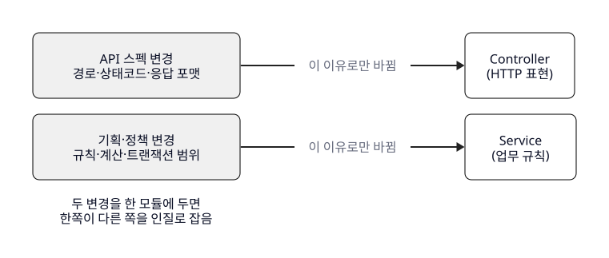
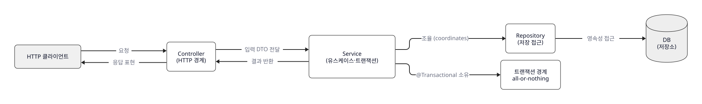

<!--
meta:
  course: spring-mvc-2026 (촬영강의, 1편=30분)
  lesson: L02 / THEORY / 10분 (편1)
  title: Controller와 Service의 책임 경계
  supersedes: _workspace/superseded_v1/scripts/L03.md (구 L03 — v1.7 레슨 재편으로 L02로 이관. 본문 서사·주장·출처 동일, 레슨 참조 갱신 + 시드 블록 소급)
  learning_goal: Controller와 Service의 책임을 구분할 수 있다. (goal ref 1)
  narrative: content-rules (b) — 문제 상황 → 깨지는 지점 → 분리 근거(변경 이유) → 책임표 → 트랜잭션 경계 → 흔한 오분류 → 언제 피할지
  central_metaphor: 홀 서버(웨이터)=Controller ↔ 주방(셰프)=Service. DTO=주문서 / Entity=식재료 / 트랜잭션=한 티켓 all-or-nothing
  metaphor_drop_point: "Service를 '데이터베이스'로 오해시키는 지점" — 주방(조리)과 저장창고(Repository/DB)를 구분할 때 비유를 버리고 계층으로 직설 (§4 트랜잭션 경계 끝, [비유 이탈 — 직설])
  used_claims: [S1-1, S1-2, S1-3, S1-4, S2-1, S3-1, S3-2, S4-1, S4-2, S4-3, S4-4, S5-1, S6-1, S6-2, S6-3, S7-1, S7-2]
  softened_unverified: [S1-3(웹계층 띄워야 검증-구조사실만/정량금지), S1-4("흔히 ~라 부른다"), S6-2(보안위험 부연 "~할 수 있다"), S7-1("실무 논쟁이 있다")]
  version_specific_cited: [S4-2 → Spring Framework Reference, Web MVC Validation (Spring 6.1 메서드 검증 주의)]
  cross_lesson: L01(요청 흐름)와 중복 금지 — Controller↔Service 배턴 지점만 확대(§5). L03 예고 다리 포함(마무리).
  cues: [SLIDE] = 촬영강의 슬라이드 전환 신호(내용 복제 아님), [IDE 예고] = L03 코드 연결 메모
  seed_blocks: 비유 ×1(§0), d2 ×6(§1 깨지는3 / §2 변경이유 / §3 책임대조 / §4 계층흐름 / §5 오분류 / §6 판단질문 → l02-d1~d6.svg 병기), IMAGE PROMPT ×1(§0 l02-fat-controller.png). v1.8 개정: 구 [IMG]→[IMAGE PROMPT] 블록 전환, 섹션별 시각요소 보충(§1/§2/§5/§6 d2 신규). 발화 서사·17주장·출처 불변. 자수 예산 불포함.
-->

# L02 — Controller와 Service의 책임 경계 (원고)

<!-- supersedes 구 L03: _workspace/superseded_v1/scripts/L03.md (v1.7 재편) -->

---

## 0. 문제 상황 — "이미 겪어봤을 코드"

[SLIDE: 제목 — "동작은 하는데, 자꾸 손이 가는 컨트롤러"]

Spring Boot로 CRUD API를 만들어 봤다면 이런 컨트롤러를 써 봤을 겁니다. 메서드 하나 안에서 파라미터를 꺼내고, 값이 이상한지 확인하고, 업무 규칙을 판단하고, 저장소를 호출하고, 응답까지 조립합니다. 잘 돌아가고 테스트도 통과합니다. 그런데 시간이 지날수록 그 메서드에만 자꾸 손이 갑니다.

이렇게 컨트롤러 하나가 모든 일을 떠안은 모양을 현장에선 흔히 "뚱뚱한 컨트롤러"라고 부릅니다. (S1-4) 공식 용어가 아니라 통칭입니다. 오늘 목표는 이 이름을 외우는 게 아니라, **무엇이 컨트롤러의 일이고 무엇이 아닌지 그 경계를 스스로 판단하는 것**입니다.


[SLIDE: 중심 비유 — 식당 "홀 서버(웨이터) ↔ 주방(셰프)"]

[비유: Controller↔Service 책임 경계 ↔ 식당 홀 서버(웨이터)↔주방(셰프) — 홀은 주문 응대·전달(HTTP 경계), 주방은 조리(업무 로직)로 역할이 갈릴 때 성립. DTO=주문서, Entity=식재료, 트랜잭션=한 티켓 all-or-nothing. 성립 한계: 주방을 '저장창고(Repository/DB)'로 보면 깨지므로 §4에서 그 지점의 비유를 버린다.]

경계를 식당 하나로 비유하겠습니다. 손님을 응대하는 **홀 서버**와 안쪽에서 요리하는 **주방**. 뚱뚱한 컨트롤러는, 홀 서버가 주문도 받고 요리까지 직접 하겠다는 식당입니다. 한 테이블이면 됩니다. 문제는 그 다음입니다.

---

## 1. 깨지는 지점 — 경계가 없으면 무엇이 무너지나

[SLIDE: "경계가 없을 때 깨지는 3가지"]

```d2
# 시드: 경계 없을 때 깨지는 3가지 (concept_model service=Service Layer가 없앨 중복 / SRP 변경격리 근거)
direction: right
classes: {
  input: { shape: rectangle; style: { fill: "#f0f0f0"; stroke: black; stroke-width: 1; border-radius: 8 } }
  problem: { shape: rectangle; style: { fill: white; stroke: black; stroke-width: 1; border-radius: 8; stroke-dash: 4 } }
}
fat: "뚱뚱한 Controller\n(HTTP + 업무규칙 혼재)" { class: input }
b1: "① 규칙 복사\n다른 진입점마다 복붙되어 흩어짐" { class: problem }
b2: "② 변경 충돌\n응답 포맷 ↔ 업무 규칙 서로 깨짐" { class: problem }
b3: "③ 검증 결합\n웹 계층 통째로 띄워야 확인 가능" { class: problem }
fat -> b1: { style.stroke: "#222222" }
fat -> b2: { style.stroke: "#222222" }
fat -> b3: { style.stroke: "#222222" }
```


**첫째, 규칙이 복사됩니다.** 같은 가입 규칙이나 재고 차감 규칙을 다른 컨트롤러나 배치, 스케줄러에서 또 써야 할 때, 규칙이 컨트롤러에 박혀 있으면 복붙되어 흩어집니다. Martin Fowler는 공통 업무 로직을 한곳에 모아 여러 진입점에 걸친 중복을 없애는 자리를 "서비스 계층"이라 불렀습니다. (S1-1 — Fowler, *PoEAA*, "Service Layer")

**둘째, 변경이 서로를 넘어뜨립니다.** HTTP 코드와 업무 규칙이 한 메서드에 섞이면, 응답 포맷을 바꾸려다 규칙을 건드리고 규칙을 손보다 엔드포인트를 깨뜨립니다. Robert C. Martin의 단일 책임 원칙 그대로죠. "한 모듈은 바뀌어야 할 이유가 오직 하나여야 한다." (S1-2 — R.C. Martin, "SRP", 2014)

**셋째, 검증하려면 웹을 통째로 띄워야 합니다.** 로직이 컨트롤러 안에 있으면 그것 하나를 확인하려고 HTTP 계층 전체를 세워야 합니다. 서비스의 평범한 객체에 있으면 웹 없이 검증할 수 있죠. (S1-3) 빠르고 느리고가 아니라, 검증에 무엇까지 딸려 오느냐의 문제입니다.

식당으로 치면, 홀 서버가 요리까지 하는 식당은 그가 자리를 비우면 요리 자체가 멈춥니다. Fowler의 말로는 애플리케이션의 "경계"가 웹 프레임워크에 묶여버린 겁니다. (S2-1 — Fowler, "Service Layer")

---

## 2. 분리의 근거 — 줄 수가 아니라 "변경 이유"로 나눈다

[SLIDE: "기준 — 줄 수 ❌ / 변경 이유 ⭕"]

```d2
# 시드: 분리 기준 = 변경 이유(출처가 다른 두 변경) (concept_model SRP / controller vs service 바뀌는 이유)
direction: right
classes: {
  input: { shape: rectangle; style: { fill: "#f0f0f0"; stroke: black; stroke-width: 1; border-radius: 8 } }
  proc: { shape: rectangle; style: { fill: white; stroke: black; stroke-width: 1; border-radius: 8 } }
}
spec: "API 스펙 변경\n경로·상태코드·응답 포맷" { class: input }
plan: "기획·정책 변경\n규칙·계산·트랜잭션 범위" { class: input }
controller: "Controller\n(HTTP 표현)" { class: proc }
service: "Service\n(업무 규칙)" { class: proc }
spec -> controller: "이 이유로만 바뀜" { style.stroke: "#222222" }
plan -> service: "이 이유로만 바뀜" { style.stroke: "#222222" }
note: "두 변경을 한 모듈에 두면\n한쪽이 다른 쪽을 인질로 잡음" { shape: text }
```



여기서 오해 하나를 끊겠습니다. 나누는 기준은 "컨트롤러가 길어서"가 **아닙니다.** 기준은 **무엇이 어떤 이유로 바뀌는가**입니다. HTTP 표현이 바뀌는 이유(경로·상태코드·응답 포맷)는 API 스펙에서 오고, 업무 규칙이 바뀌는 이유(정책·계산·트랜잭션 범위)는 기획에서 옵니다. 출처가 다른 두 변경을 한 모듈에 두면 한쪽이 다른 쪽을 인질로 잡습니다. Martin은 이 원칙을 "결국 사람에 관한 것"이라 했습니다 — 다른 이해관계자의 변경이 서로를 깨지 않게 격리하라는 뜻이죠. (S3-1 — R.C. Martin, "SRP", 2014)

단, "서비스로 옮기면 끝"은 아닙니다. 모든 로직을 서비스에 몰고 도메인을 게터·세터 껍데기로 두면 "빈혈 도메인 모델"이라는 또 다른 안티패턴이 됩니다. (S3-2 — Fowler, "AnemicDomainModel") 그 이야기는 뒤 강의에서 더 다루고, 오늘은 **"서비스는 로직 던져 넣는 만능 창고가 아니다"** 정도만 붙잡겠습니다.

---

## 3. 핵심 구조 — 두 계층의 책임표

[SLIDE: 책임 대조표 (한 슬라이드 한 표)]

```d2
# 시드: 책임 대조 구도 (Controller vs Service). 01_concept_model relationships delegates_use_case / returns_result 발췌
direction: right
classes: {
  proc: { shape: rectangle; style: { fill: white; stroke: black; stroke-width: 1; border-radius: 8 } }
}
controller: "Controller (홀 서버)\nHTTP 경계 어댑터" {
  class: proc
  r1: "요청 매핑" { class: proc }
  r2: "입력 바인딩 → DTO 변환" { class: proc }
  r3: "형식 검증 트리거 (@Valid)" { class: proc }
  r4: "예외 → 상태코드 / 응답 조립" { class: proc }
}
service: "Service (주방)\n유스케이스·트랜잭션 경계" {
  class: proc
  s1: "업무 규칙 실행" { class: proc }
  s2: "도메인 / 저장소 조율" { class: proc }
  s3: "트랜잭션 제어 (@Transactional)" { class: proc }
}
controller -> service: "유스케이스 위임 (배턴)" { style.stroke: "#222222" }
service -> controller: "결과 반환" { style.stroke: "#222222" }
```


| | Controller (홀 서버) | Service (주방) |
|---|---|---|
| 한 문장 | HTTP와 애플리케이션 사이의 어댑터 | 유스케이스 + 트랜잭션 경계 |
| 하는 일 | 매핑·바인딩·형식 검증 트리거·예외→상태코드·응답 조립 | 업무 규칙 실행·도메인/저장소 조율·트랜잭션 제어 |
| 다루는 것 | 주문서(요청 DTO) ↔ 상태 전달 | 레시피(업무 로직), 티켓 하나 = 전부 아니면 취소 |
| 바뀌는 이유 | 경로·상태코드·응답 포맷 | 정책·계산·트랜잭션 범위 |

**Controller**는 HTTP 경계의 어댑터입니다 — 표의 왼쪽 열이 전부 여기죠. Spring 레퍼런스도 컨트롤러를 "HTTP 요청과 비즈니스 로직 사이의 다리"로 설명합니다. (S4-1 — Spring Framework Reference, Web MVC "Annotated Controllers", Spring 6.x / Boot 3.4.x)

검증은 한 겹만 짚겠습니다. `@Valid` 같은 형식·제약 검증은 **컨트롤러 경계에서** 트리거됩니다. (참고로 Spring 6.1부터는 내장 메서드 검증을 쓰려면 클래스 레벨 `@Validated`를 빼야 하는 등 버전마다 동작이 갈리니 공식 문서를 확인하세요. (S4-2 — Spring Framework Reference, Web MVC "Validation")) 중요한 건 **여기서의 검증은 "형식이 맞는가"이지 "업무적으로 되는가"가 아니라는 점**입니다.

**Service**는 유스케이스이자 트랜잭션 경계입니다. Fowler의 정의로 서비스 계층은 "업무 로직을 캡슐화하고, 트랜잭션을 제어하며, 응답을 조율"합니다. (S4-3 — Fowler, "Service Layer")

한 요청이 이 둘을 지나는 지점만 짚겠습니다. 컨트롤러가 요청을 받아 입력 DTO로 바꿔 **서비스의 유스케이스 메서드에 넘기고, 서비스가 결과를 돌려주면 컨트롤러가 응답 표현으로 바꿉니다.** 딱 이 배턴을 주고받는 한 지점이 오늘의 무대입니다. DispatcherServlet이 여기까지 어떻게 오는지는 L01에서 봤으니 반복하지 않습니다. (S5-1)

---

## 4. 트랜잭션 경계 — 왜 하필 Service인가 (오늘의 핵심)

[SLIDE: 강조 — "트랜잭션 경계 = 유스케이스 경계 = Service"]

오늘 한 장만 남긴다면 이 슬라이드입니다. 주방 티켓을 떠올려 보세요. 스테이크와 사이드가 한 티켓이면 둘 다 나가거나 둘 다 안 나갑니다. 반쪽짜리 서빙은 없죠. 하나의 업무 단위가 전부-아니면-전무로 처리되는 것, 이게 트랜잭션이고, 그 단위를 정의하는 자리가 서비스의 유스케이스 메서드입니다.

Spring 팀도 명시적으로 권장합니다. "`@Transactional`은 인터페이스가 아니라 구체 클래스의 메서드에 붙여라." (S4-4 — Spring Framework Reference, Data Access "Using @Transactional") 실무에서 그 구체 클래스가 서비스죠. 그래서 트랜잭션 경계 = 유스케이스 경계 = 서비스입니다.

[비유 이탈 — 직설] 여기서 비유 하나는 일부러 버립니다. 주방을 "재료 창고"나 "데이터베이스"로 생각하면 안 됩니다. 주방은 **조리하는 곳**, 즉 업무를 조율하는 유스케이스입니다. 재료를 넣고 꺼내는 저장창고는 **별개 계층 Repository**이고 그 뒤에 DB가 있습니다.

```d2
# 시드: 계층 흐름. 01_concept_model relationships delegates_use_case / coordinates / owns 발췌
direction: right
classes: {
  input: { shape: rectangle; style: { fill: "#f0f0f0"; stroke: black; stroke-width: 1; border-radius: 8 } }
  proc: { shape: rectangle; style: { fill: white; stroke: black; stroke-width: 1; border-radius: 8 } }
  db: { shape: cylinder; style: { fill: "#eeeeee"; stroke: black; stroke-width: 1 } }
}
client: "HTTP 클라이언트" { class: input }
controller: "Controller\n(HTTP 경계)" { class: proc }
service: "Service\n(유스케이스·트랜잭션)" { class: proc }
repository: "Repository\n(저장 접근)" { class: proc }
db: "DB\n(저장소)" { class: db }
tx: "트랜잭션 경계\nall-or-nothing" { class: proc }
client -> controller: "요청" { style.stroke: "#222222" }
controller -> service: "입력 DTO 전달" { style.stroke: "#222222" }
service -> repository: "조율 (coordinates)" { style.stroke: "#222222" }
repository -> db: "영속성 접근" { style.stroke: "#222222" }
service -> controller: "결과 반환" { style.stroke: "#222222" }
controller -> client: "응답 표현" { style.stroke: "#222222" }
service -> tx: "@Transactional 소유" { style.stroke: "#222222" }
```



```
Controller → Service → Repository → DB
 (HTTP경계)  (유스케이스·트랜잭션)  (저장 접근)  (저장소)
```

서비스가 저장소를 호출하긴 해도 서비스가 곧 저장소는 아닙니다. 이 층이 흐려지면 다음 오분류가 시작됩니다.

---

## 5. 흔한 오분류 — 경계를 헷갈리는 세 지점

[SLIDE: "자주 틀리는 3가지"]

```d2
# 시드: 흔한 오분류 3가지 — 잘못된 위치→올바른 위치 (concept_model transaction-boundary / dto / service)
direction: right
classes: {
  problem: { shape: rectangle; style: { fill: white; stroke: black; stroke-width: 1; border-radius: 8; stroke-dash: 4 } }
  proc: { shape: rectangle; style: { fill: white; stroke: black; stroke-width: 1; border-radius: 8 } }
}
wrong: "자주 틀리는 위치" {
  class: problem
  w1: "@Transactional 을 Controller 에" { class: problem }
  w2: "DTO 와 Entity 를 혼용" { class: problem }
  w3: "업무 규칙 검증을 Controller 에" { class: problem }
}
right: "올바른 위치" {
  class: proc
  r1: "@Transactional 은 Service 구체 클래스 메서드" { class: proc }
  r2: "경계에서 DTO ↔ Entity 변환" { class: proc }
  r3: "형식 검증=Controller / 업무 검증=Service" { class: proc }
}
wrong.w1 -> right.r1: { style.stroke: "#222222" }
wrong.w2 -> right.r2: { style.stroke: "#222222" }
wrong.w3 -> right.r3: { style.stroke: "#222222" }
```


**① 트랜잭션을 웹 계층에 둔다.** `@Transactional`을 컨트롤러에 붙이거나, 컨트롤러에서 저장소를 여러 번 이어 호출해 업무 단위 경계를 웹에 만드는 것. 권장은 서비스 구체 클래스 메서드죠. (S6-1 — Spring Reference, "Using @Transactional")

**② 주문서와 식재료를 같은 것으로 쓴다 — DTO/Entity 혼용.** 요청·응답용 DTO와 도메인·영속 Entity를 구분 없이 씁니다. Fowler의 정의로 DTO는 "프로세스 경계를 넘어 데이터를 나르는 객체"로 목적이 다릅니다. (S6-2 — Fowler, *PoEAA*, "Data Transfer Object") 주문서엔 "스테이크 미디엄"이라 적지 소가 통째로 적히진 않죠. 엔티티를 그대로 노출하면 직렬화·바인딩 관심사가 도메인으로 새거나 필드가 과하게 드러날 수도 있습니다. 경계에서 데이터 모양을 바꾸는 변환이 컨트롤러의 일입니다.

**③ 업무 규칙 검증을 형식 검증과 같은 층으로 본다.** `@NotBlank`·`@Min` 같은 형식 검증은 컨트롤러 경계지만, "이미 가입된 이메일인가", "잔액이 부족한가" 같은 **업무 규칙 검증은 서비스**입니다. (S6-3) 홀 서버는 "메뉴에 있는 주문인지"는 확인해도 "재료가 남았는지"는 주방이 압니다.

---

## 6. 마무리 — 언제 이 분리가 과한가

[SLIDE: "항상 나눠야 하나? — 판단 기준"]

```d2
# 시드: 배치 판단 두 질문 (concept_model SRP=변경이유 / Service Layer=재사용 경계)
direction: right
classes: {
  decision: { shape: diamond; style: { fill: white; stroke: black; stroke-width: 1 } }
  proc: { shape: rectangle; style: { fill: white; stroke: black; stroke-width: 1; border-radius: 8 } }
}
q1: "이 변경은 어떤 이유로 오는가?" { class: decision }
q2: "이 로직을 다른 진입점에서도 재사용하나?" { class: decision }
controller: "Controller 에 둔다" { class: proc }
service: "Service 에 둔다" { class: proc }
q1 -> controller: "HTTP 표현 변경" { style.stroke: "#222222" }
q1 -> service: "업무 규칙 변경" { style.stroke: "#222222" }
q2 -> service: "재사용 필요 → 경계 생성" { style.stroke: "#222222" }
```


무조건 서비스를 만들어야 할까요? 아닙니다. 서비스가 저장소를 1:1로 넘기기만 하는, 규칙 없는 순수 통과형 CRUD에서는 로직 없는 서비스가 상용구만 늘린다는 **실무 논쟁이 있습니다.** (S7-1) 정답이 정해진 규칙이 아니라 판단의 문제라, "서비스를 없애라"가 아니라 이렇게 물어야 합니다 — **"이 계층은 무엇을 위해 있는가?"**

그래서 오늘의 결론은 외울 규칙이 아니라 두 개의 질문입니다. (S7-2)

[SLIDE: 마지막 — 두 개의 질문]

- **"이 변경은 어떤 이유로 오는가?"** (SRP — HTTP 표현이면 Controller, 업무 규칙이면 Service)
- **"이 로직을 다른 진입점에서도 재사용해야 하는가?"** (Service Layer — 경계가 필요하면 Service)

이 둘에 답할 수 있으면 새 코드를 어디에 둘지 스스로 판단할 수 있습니다. 그게 오늘의 목표였습니다.

[IDE 예고 — L03에서 코드] 다음 레슨에선 회원 가입 API를 만들며 **일부러 규칙을 컨트롤러에 뭉쳐 뚱뚱하게 만들었다가 서비스로 분리하는 과정**을 코드로 봅니다. 오늘 말로 그린 경계가, 화면에서 코드가 자리를 옮기는 것으로 다시 확인될 겁니다.

[SLIDE: 다음 레슨 예고 — L03 "기본 Controller 구현: 요청 매핑부터 응답까지"]
