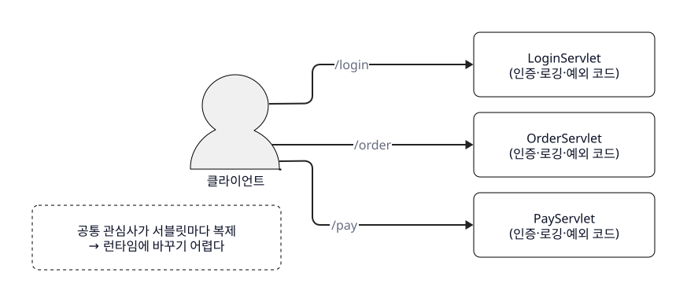
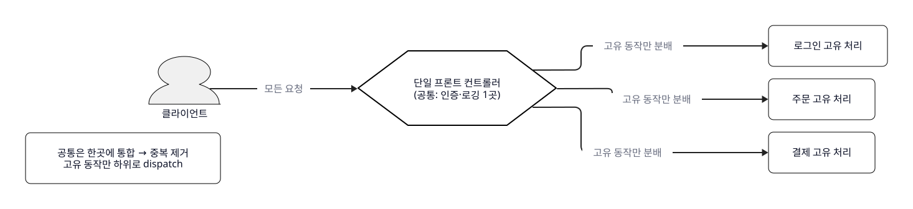
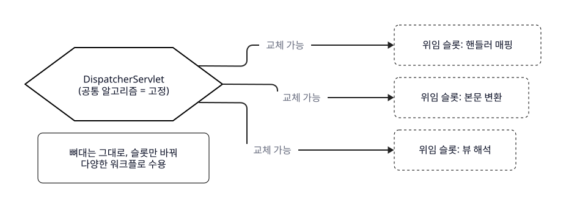
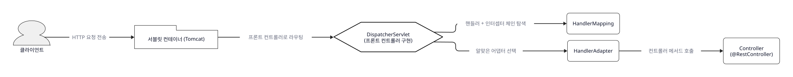
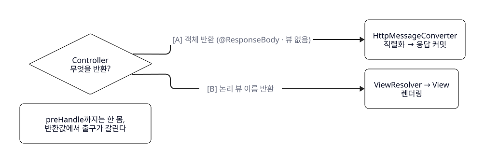

<!--
lesson_id: L01
course: spring-mvc-offline-2026
delivery_type: offline
lesson_mode: THEORY
duration_minutes: 45   # 판서 이론 ~28분 + 시뮬 파트 ~15분 + 정리 ~2분. 발화 원고는 30분 상한(7,500~9,000자 공백제외) 기준.
slide_mode: summary    # 판서 수업 전제 — 슬라이드는 컷당 한 줄, 나머지는 강사 판서로 채운다. 원고 = "무엇을 말하고 무엇을 판서할지" 시나리오.
learning_goal: HTTP 요청이 Spring MVC 내부에서 처리되는 흐름을 설명할 수 있다. (ref 0)
central_metaphor: 건물 정문의 단일 안내데스크 (spring-mvc-2026 촬영판 재사용)
central_thread: 회원가입 요청 POST /members 한 건의 왕복 (L03에서 학생이 직접 구현할 요청)
simulator: simulators/시뮬레이터_MVC요청흐름.html (재사용, offline_interactive 프로파일 — 모드 A=@RestController STEP 0~10, 모드 B=@Controller STEP 0~12)
climax: 모드 A STEP 8~9 — "응답은 언제 만들어지고 언제 커밋되는가" (postHandle 이전 커밋)
cut_candidates: 7   # G5 컷 승인 대상. 컷 1~3 = 판서 이론(~28분), 컷 4~6 = 시뮬 파트(~15분), 컷 7 = 정리(~2분)
sim_part: 컷 4~6 (STEP 0~12). [SIM 실행]은 컷 4 초입, [SIM 종료]는 컷 6 말미.
reuse_from: spring-mvc-2026/scripts/L01.md (촬영판 — 서사 뼈대 참고, 오프라인 판서용으로 전면 재구성. 판서·문답 메모 추가, 발화 밀도 재배분)
used_claims: [C-01, C-02, C-03, C-04, C-05, C-15, C-17, C-18, S-01, S-02, S-03, S-04, S-05, S-06, S-07, S-08, S-09, S-10, S-11, S-12, S-14, S-15, S-16]
excluded_claims: [V-01, V-02]  # unverified — Jackson 자동구성 기본값/ThemeResolver 제거 시점은 원고 제외
book_format: v1.8  # [IMAGE PROMPT] 1개(ol1-dispatcher-desk) + d2 5블록(ol1-d1~d5, SVG 병기) + 컷마다 예시/비유·시각요소. 비발화(판서·문답·시드) 자수 제외.
-->

# L01 — 요청은 왜 DispatcherServlet 한 곳으로 모이는가 (판서 수업)

> 오프라인 판서 강의. 강사가 칠판에 그려 가며 진행한다. `[판서: ...]`는 무엇을 판서할지, `[문답: ...]`는 학생에게 던질 질문/받을 지점, `[SIM ...]`은 시뮬레이터 조작 큐다. 이 세 메모와 d2/이미지/비유 블록은 발화가 아니다.

---

## 컷 1 후보 — 문제 상황: 서블릿마다 요금소를 세우던 시절 (~7분)

> summary 슬라이드: "요청 하나 = 서블릿 하나?"

`[판서: 칠판 왼쪽에 세로로 세 줄 — /login → [LoginServlet], /order → [OrderServlet], /pay → [PayServlet]. 각 상자 밑에 작게 "(인증·로깅·예외)"라고 똑같이 세 번 적는다. 이 "똑같이 세 번"이 오늘의 첫 그림이다.]`

여러분 모두 Spring Boot로 CRUD API 한 번씩은 만들어 보셨을 겁니다. `@GetMapping("/members")` 한 줄 붙이면 그 URL이 이 메서드로 딱 연결되죠. 너무 당연해서 아무도 안 물어보는 질문 하나를 오늘 45분 동안 끝까지 파볼 겁니다 — 스프링은 이 연결을 대체 '어떻게' 아는 걸까요? 그리고 요청이 그 메서드에 도착하기 전까지 무슨 일을 거치는 걸까요. 오늘 수업이 끝나면 여러분은 요청 한 건이 서버에 들어와서 응답으로 나갈 때까지 어디를 지나는지를 지금 제가 칠판에 그리듯 직접 그릴 수 있게 됩니다.

답을 찾으려면 스프링이 없던 시절, 순수 서블릿만 있던 때로 잠깐 돌아가야 합니다. 그때는 방식이 단순했어요. URL 하나에 서블릿 하나를 직접 매핑했습니다. `/login` 요청이 오면 LoginServlet이, `/order`면 OrderServlet이, `/pay`면 PayServlet이 받았죠. [판서 가리키며] 지금 칠판에 그린 이대로입니다. 각 서블릿이 자기한테 온 요청을 처음부터 끝까지 혼자 다 처리했어요.

비유하자면 고속도로에 도로가 세 개 있는데, 도로마다 요금소를 따로따로 세운 겁니다. 요금소 하나하나가 통행권 검사도 하고, 요금도 받고, 차량 기록도 남기고요. 도로마다 완전히 독립된 요금소가 서 있는 그림입니다.

[비유: 서블릿 직접 매핑 ↔ 도로마다 세운 독립 요금소 — 요청 경로마다 처리 주체가 따로 서 있다는 점까지만 성립. 실제 서블릿은 물리적 위치가 아니라 URL 패턴에 매핑된 객체다.]

```d2
# 시드 ol1-d1: 문제 상황 — URL마다 서블릿을 직접 매핑, 공통 관심사가 서블릿마다 복제 (concept_model: front-controller-pattern 이 해결할 문제 / brief C-02·C-03)
direction: right
classes: {
  start: { shape: person; style: { fill: "#f0f0f0"; stroke: black; stroke-width: 1 } }
  node: { shape: rectangle; style: { fill: white; stroke: black; stroke-width: 1; border-radius: 8 } }
  problem: { shape: rectangle; style: { fill: white; stroke: black; stroke-width: 1; border-radius: 8; stroke-dash: 4 } }
}
client: "클라이언트" { class: start }
login: "LoginServlet\n(인증·로깅·예외 코드)" { class: node }
order: "OrderServlet\n(인증·로깅·예외 코드)" { class: node }
pay: "PayServlet\n(인증·로깅·예외 코드)" { class: node }
client -> login: "/login" { style.stroke: "#222222" }
client -> order: "/order" { style.stroke: "#222222" }
client -> pay: "/pay" { style.stroke: "#222222" }
note: "공통 관심사가 서블릿마다 복제\n→ 런타임에 바꾸기 어렵다" { class: problem }
```


[문답: 여기서 잠깐 멈추고 던진다 — "이 구조, 서비스가 커지면 뭐가 불편해질 것 같으세요?" 학생 답을 2~3개 받는다. '똑같은 코드 반복', '고치기 힘들다', '빠뜨리기 쉽다' 중 하나가 나오면 그걸 그대로 다음 컷의 출발점으로 삼는다. 아무 답도 안 나오면 칠판의 "(인증·로깅·예외)" 세 번 적은 걸 손으로 짚으며 넘어간다.]

---

## 컷 2 후보 — 깨지는 지점, 그리고 Front Controller의 등장 (~9분)

> summary 슬라이드: "공통은 한곳에, 고유만 나눠서"

방금 여러분이 짚어준 게 정확히 이 구조가 깨지는 지점입니다. 요청마다 똑같이 해야 하는 일이 있다는 거예요 — 로그인했는지 확인하고, 로그를 남기고, 예외를 처리하고. [판서: 칠판의 세 서블릿 밑 "(인증·로깅·예외)"를 빨간 분필 등으로 세 번 다 동그라미 치며] 서블릿이 세 개면 이 인증 코드가 세 군데에 복사됩니다. 실무에선 서블릿이 수십 개죠. 그럼 수십 군데에 같은 코드가 흩어지는 겁니다.

이건 제 감상이 아니라 정리된 문제입니다. Martin Fowler는 이렇게 말합니다 — "입력 컨트롤러 동작이 여러 객체에 흩어지면, 그 동작의 상당 부분이 결국 중복된다" (Martin Fowler, *PoEAA*, Front Controller). 그리고 한 문장 더 붙입니다 — 흩어져 있으면 "런타임에 동작을 바꾸기도 어렵다" (같은 출처). 생각해 보세요. 인증 정책을 하나 바꾸려는데 코드가 스무 군데 흩어져 있으면, 스무 군데를 다 고쳐야 하고 한 군데라도 빠뜨리면 거기가 그대로 보안 구멍이 됩니다. 실무에서 "이 API만 인증이 안 걸려 있었다"는 사고가 나는 게 대개 이런 구조에서예요. 코드가 중복된다는 건 단순히 손이 더 가는 문제가 아니라, 빠뜨릴 자리가 그만큼 많아진다는 뜻입니다.

[판서: 오른쪽에 새 그림을 그리기 시작한다. 가운데에 큰 육각형 하나를 그리고 "단일 프론트 컨트롤러 / (공통 처리 1곳)"라고 쓴다. 왼쪽에서 화살표 세 개(모든 요청)를 이 육각형으로 모으고, 오른쪽으로 화살표 세 개를 뻗어 [로그인 처리] [주문 처리] [결제 처리]로 나눈다.]

그래서 나온 해법이 Front Controller 패턴입니다. 핵심 아이디어는 딱 한 문장이에요 — "모든 요청 처리를 단일 핸들러 객체 하나로 통과시켜 통합하고, 이 객체가 공통 동작을 수행한 뒤, 요청별 고유 동작은 하위 객체로 분배(dispatch)한다" (Fowler, 같은 출처). 인증 코드를 서블릿마다 복사하지 말고, 모든 요청이 반드시 지나는 길목 한 곳에 딱 한 번만 두자는 발상입니다.

요금소 비유로 돌아가면 이렇습니다. 도로마다 요금소를 세우는 대신, 모든 차가 반드시 지나는 대표 톨게이트를 하나만 세우는 거예요. 통행권 검사·요금·기록 같은 공통 절차는 이 대표 톨게이트에서 딱 한 번 처리하고, 그다음 각자 목적지 도로로 갈라져 나갑니다. 검사 규칙을 바꾸고 싶으면? 이제 톨게이트 한 곳만 고치면 됩니다.

```d2
# 시드 ol1-d2: 해결 — 프론트 컨트롤러가 공통 처리를 한곳에 통합하고 고유 동작만 분배 (concept_model: front-controller-pattern / brief C-04)
direction: right
classes: {
  start: { shape: person; style: { fill: "#f0f0f0"; stroke: black; stroke-width: 1 } }
  node: { shape: rectangle; style: { fill: white; stroke: black; stroke-width: 1; border-radius: 8 } }
  front: { shape: hexagon; style: { fill: white; stroke: black; stroke-width: 2 } }
  note: { shape: rectangle; style: { fill: white; stroke: black; stroke-width: 1; border-radius: 8 } }
}
client: "클라이언트" { class: start }
front: "단일 프론트 컨트롤러\n(공통: 인증·로깅 1곳)" { class: front }
login: "로그인 고유 처리" { class: node }
order: "주문 고유 처리" { class: node }
pay: "결제 고유 처리" { class: node }
client -> front: "모든 요청" { style.stroke: "#222222" }
front -> login: "고유 동작만 분배" { style.stroke: "#222222" }
front -> order: "고유 동작만 분배" { style.stroke: "#222222" }
front -> pay: "고유 동작만 분배" { style.stroke: "#222222" }
note: "공통은 한곳에 통합 → 중복 제거\n고유 동작만 하위로 dispatch" { class: note }
```


[문답: "그럼 이 대표 톨게이트, 즉 프론트 컨트롤러가 스프링에선 뭘까요? 이름 들어보신 분?" — DispatcherServlet이라는 답이 나오면 바로 다음 컷으로. 안 나와도 자연스럽게 "그 이름이 바로 다음에 나옵니다" 하고 넘어간다.]

---

## 컷 3 후보 — DispatcherServlet = 건물의 단일 안내데스크 (~11분)

> summary 슬라이드: "DispatcherServlet — 공통 알고리즘은 고정, 위임 컴포넌트는 교체"

`[판서: 방금 그린 육각형 안의 "단일 프론트 컨트롤러" 밑에 큰 글씨로 DispatcherServlet 이라고 적는다. 화면 상단에 이 단어를 한 번 더 크게 써 두고 밑줄. 오늘의 주인공이다.]`

Spring MVC에서 그 단일 핸들러, 대표 톨게이트가 바로 `DispatcherServlet`입니다. 공식 문서는 이걸 "요청 처리의 공통 알고리즘을 제공하는 중앙 서블릿"이라 규정하고, 실제 작업은 "설정 가능한 위임 컴포넌트"가 한다고 설명합니다 (Spring Framework Reference, DispatcherServlet). 방금 우리가 손으로 그린 그림을 스프링 팀이 문장으로 똑같이 적어 둔 거예요.

이제 오늘 끝까지 함께 갈 비유를 하나 정하겠습니다. 요금소 그림은 여기까지 역할을 다했고, 지금부터는 건물 정문의 안내데스크로 갈아탑니다. 큰 회사 건물을 떠올려 보세요. 방문객이 아무리 많아도 정문은 하나고, 그 앞에 안내데스크가 딱 하나 있죠. 방문객은 일단 전부 이 데스크로 모입니다. 데스크는 공통 절차 — 방문 기록, 신분 확인 — 를 처리한 뒤, "3층 개발팀으로 가세요" 하고 담당 부서로 안내합니다. 이 안내데스크가 `DispatcherServlet`이고, 담당 부서 하나하나가 여러분이 만드는 컨트롤러입니다.

[비유: DispatcherServlet ↔ 건물 정문의 단일 안내데스크 — 정문이 하나라 공통 절차(방문 기록·신분 확인)를 한곳에서 처리하고 담당 부서로 안내한다는 점까지 성립. 단, 데스크 직원이 부서 업무를 대신 처리하지는 않는다 — DispatcherServlet도 실제 업무 로직은 컨트롤러에 위임할 뿐 스스로 처리하지 않는다. 비유가 여기서 흐려지면 버리고 "위임"이라고 직설한다.]


*정문의 안내데스크 하나 = DispatcherServlet, 갈라지는 복도 = 각 컨트롤러*

그럼 데스크는 부서 위치를 어떻게 알까요. 미리 외워 두는 게 아니라, 스프링 설정을 뒤져서 요청 매핑·뷰 해석 같은 위임 컴포넌트를 "찾아냅니다(discover)" (같은 출처). 여러분이 `@GetMapping("/members")` 하나 붙여 두면, 이 데스크가 그 매핑 정보를 발견해서 "아, `/members`는 이 컨트롤러 담당이구나" 하고 알아내는 겁니다. 컷 1에서 던진 첫 질문 — "스프링은 이 연결을 어떻게 아는가" — 의 답이 바로 이 'discover'예요.

`[판서: 안내데스크(육각형) 오른쪽에 슬롯 세 칸을 그린다 — [핸들러 매핑] [본문 변환] [뷰 해석]. 각 슬롯을 점선 네모로 감싸 "갈아 끼울 수 있음"을 표시. 육각형 자체엔 "공통 알고리즘 = 고정"이라 적는다.]`

이 구조가 왜 좋은지 마지막으로 짚고 넘어가죠. 참고로 중앙 진입점 하나를 두는 건 스프링만의 발명이 아니라 "다른 많은 웹 프레임워크와 마찬가지"인 공통 설계입니다 (Spring Framework Reference, DispatcherServlet). 왜 다들 이렇게 만들까요. 공통 처리는 한곳에서 표준화하면서도, 부분만 갈아 끼울 수 있기 때문입니다. 예를 들어 응답을 JSON에서 XML로 바꾸고 싶으면, 안내데스크를 통째로 뜯는 게 아니라 '본문 변환' 담당 슬롯만 교체하면 됩니다. 공식 문서 표현으로 "이 모델은 유연하며 다양한 워크플로를 지원한다" (같은 출처). 게다가 모든 슬롯이 늘 켜지는 것도 아니에요 — 필요 없는 위임 컴포넌트는 생략됩니다. 로케일 해석이 필요 없으면 로케일 리졸버도 없는 거죠 (Spring Framework Reference, Processing). 이 "필요한 관문만 열린다"는 성질, 잠시 뒤 시뮬레이터에서 눈으로 확인할 겁니다.

```d2
# 시드 ol1-d3: 유연성 — 공통 알고리즘은 고정, 위임 컴포넌트는 교체 가능한 슬롯 (concept_model: dispatcher-servlet / brief C-05·C-17·C-18)
direction: right
classes: {
  front: { shape: hexagon; style: { fill: white; stroke: black; stroke-width: 2 } }
  slot: { shape: rectangle; style: { fill: white; stroke: black; stroke-width: 1; border-radius: 8; stroke-dash: 4 } }
  note: { shape: rectangle; style: { fill: white; stroke: black; stroke-width: 1; border-radius: 8 } }
}
dispatcher: "DispatcherServlet\n(공통 알고리즘 = 고정)" { class: front }
slot1: "위임 슬롯: 핸들러 매핑" { class: slot }
slot2: "위임 슬롯: 본문 변환" { class: slot }
slot3: "위임 슬롯: 뷰 해석" { class: slot }
dispatcher -> slot1: "교체 가능" { style.stroke: "#222222" }
dispatcher -> slot2: "교체 가능" { style.stroke: "#222222" }
dispatcher -> slot3: "교체 가능" { style.stroke: "#222222" }
note: "뼈대는 그대로, 슬롯만 바꿔\n다양한 워크플로 수용" { class: note }
```


[문답: "여기까지 질문 있나요?" 로 이론부를 한 번 닫는다. 없으면 → "말로만 들으면 아직 뜬구름 같죠. 이제 이 데스크가 요청 한 건을 실제로 어떤 순서로 처리하는지, 직접 눌러 보면서 추적합니다."]

---

## 컷 4 후보 — [SIM 실행] 모드 A: 요청이 데스크에 도착하기까지 (STEP 0~6) (~6분)

> summary 슬라이드: "따라가 보자 — POST /members 한 건"

이제 화면을 시뮬레이터로 바꾸겠습니다. 재료는 딱 하나의 요청이에요 — 회원가입 `POST /members`. 뒤 시간(L03)에 여러분이 직접 손으로 만들 바로 그 요청입니다. 화면이 뭘 보여주든 하나만 붙잡으세요 — **저 관문이 왜 거기 있는가.**

`[SIM 실행: 시뮬레이터_MVC요청흐름.html]` (모드 A = ① @RestController 선택 확인. offline_interactive라 STEP은 강사가 클릭으로 넘긴다. 학생 질문이 나오면 파라미터를 바꿔 즉석 탐색해도 됨.)

```d2
# 시드 ol1-d4: 요청 진입 흐름(클라이언트~컨트롤러 호출) — 시뮬레이터 STEP 0~7의 정본 순서 (brief S-01~S-09, 시퀀스)
direction: right
classes: {
  start: { shape: person; style: { fill: "#f0f0f0"; stroke: black; stroke-width: 1 } }
  container: { shape: package; style: { fill: white; stroke: black; stroke-width: 1 } }
  front: { shape: hexagon; style: { fill: white; stroke: black; stroke-width: 2 } }
  node: { shape: rectangle; style: { fill: white; stroke: black; stroke-width: 1; border-radius: 8 } }
}
client: "클라이언트" { class: start }
tomcat: "서블릿 컨테이너 (Tomcat)" { class: container }
dispatcher: "DispatcherServlet\n(프론트 컨트롤러 구현)" { class: front }
mapping: "HandlerMapping" { class: node }
adapter: "HandlerAdapter" { class: node }
controller: "Controller\n(@RestController)" { class: node }
client -> tomcat: "HTTP 요청 전송" { style.stroke: "#222222" }
tomcat -> dispatcher: "프론트 컨트롤러로 라우팅" { style.stroke: "#222222" }
dispatcher -> mapping: "핸들러 + 인터셉터 체인 탐색" { style.stroke: "#222222" }
dispatcher -> adapter: "알맞은 어댑터 선택" { style.stroke: "#222222" }
adapter -> controller: "컨트롤러 메서드 호출" { style.stroke: "#222222" }
```


`[SIM STEP 0]`
출발점입니다. 요청은 아직 서버 밖에 있어요. JSON 본문 하나를 손에 들고 서버로 향하는 중입니다. 이 순간 스프링은 이 요청이 온다는 것조차 모릅니다.

`[SIM STEP 1]`
요청을 가장 먼저 받는 건 스프링이 아닙니다. 서블릿 컨테이너, 즉 Tomcat이에요. 여기가 초심자가 자주 헷갈리는 지점입니다. 우리가 스프링으로 개발하니까 스프링이 요청을 제일 먼저 받는다고 생각하기 쉬운데, 그렇지 않아요. Spring MVC의 입구인 DispatcherServlet도 결국 이름 그대로 '서블릿' 한 개거든요. 서블릿은 컨테이너 없이는 혼자 못 돕니다. `spring-boot-starter-web`을 넣으면 Tomcat이 딸려 오는 이유가 이거예요 — 스프링을 실행할 무대가 먼저 있어야 하니까요. 그래서 첫 접수는 언제나 컨테이너 몫입니다.

`[판서: 시뮬 화면 옆 칠판에 가로 흐름선을 시작한다 — [Tomcat] 이라고 첫 상자를 그린다. 이 흐름선은 컷 6까지 계속 오른쪽으로 이어 그린다.]`

`[SIM STEP 2]`
컨테이너는 이 요청을 어디로 넘길까요. 컷 1의 그 옛날 방식이면 URL마다 다른 서블릿으로 갔겠죠. 하지만 지금은 프론트 컨트롤러로 등록된 단 하나의 서블릿 — DispatcherServlet으로 몰아줍니다. 이론에서 그린 '모든 요청을 한곳으로 모은다'가 실제로 일어나는 지점이 바로 여기예요.

`[판서: 흐름선에 [DispatcherServlet] 상자를 잇는다. 이 상자만 조금 크게, 밑줄.]`

`[SIM STEP 3]`
데스크에 요청이 도착했는데, 컨트롤러를 바로 부르지 않고 준비부터 합니다. WebApplicationContext와 LocaleResolver를 request에 미리 붙여 둬요. 이후 어느 단계에서든 꺼내 쓸 수 있게 미리 깔아두는 겁니다. multipart 검사도 여기서 하는데, 이 요청은 파일 업로드가 아니라 그냥 JSON이라 해당 없음으로 지나갑니다. 아까 이론에서 말한 "필요한 관문만 열린다"가 여기서 눈에 보이죠 (Spring Framework Reference, Processing).

`[SIM STEP 4]`
이제 진짜 질문 — 이 `POST /members`를 누가 처리하지? 그 답을 찾아 주는 게 HandlerMapping입니다. 요청에 맞는 핸들러 하나, 그리고 그 앞뒤에 끼워질 인터셉터 체인까지 한 묶음으로 찾아냅니다 (Spring Framework Reference, Special Bean Types). 안내데스크가 방문록을 뒤져 "3층 개발팀" 하고 담당을 찾아 주는 그 장면입니다.

`[판서: 흐름선에 [HandlerMapping] 을 잇는다.]`

`[SIM STEP 5]`
그런데 왜 어댑터가 하나 더 낄까요. 컨트롤러를 호출하는 방식이 한 가지가 아니기 때문입니다. HandlerAdapter가 그 방식 차이를 흡수해서, DispatcherServlet은 '핸들러를 구체적으로 어떻게 부르는지' 세부를 몰라도 되게 차단해 줍니다 (Spring Framework Reference, Special Bean Types). 데스크 직원이 부서마다 다른 내선 규칙을 일일이 안 외워도, 교환대가 알아서 연결해 주는 것과 같아요.

`[판서: 흐름선에 [HandlerAdapter] 를 잇는다.]`

`[SIM STEP 6]`
컨트롤러를 부르기 직전, 인터셉터의 preHandle이 먼저 끼어듭니다. '핸들러 실행 전' 공통 처리 자리예요. 여기서 `false`를 반환하면 체인이 그대로 끊기고 컨트롤러는 아예 호출되지 않습니다 (Spring Framework Reference, Interception). 데스크 앞 보안 게이트라고 보면 됩니다 — 통과 못 하면 안쪽 부서까지 가지도 못하죠. 이 STEP 6까지가 두 경로가 완전히 똑같은 구간이라는 걸 기억해 두세요. 잠시 뒤 갈라집니다.

[문답: "여기까지 여섯 단계, 컨트롤러는 아직 한 번도 안 불렸어요. 우리가 만든 코드는 어디 있죠?" — 학생이 '아직 안 나왔다'를 인지하게 만든 뒤 STEP 7로.]

---

## 컷 5 후보 — 모드 A 클라이맥스: 응답은 언제 커밋되는가 (STEP 7~10) (~5분)

> summary 슬라이드: "@RestController — 뷰는 없다. 응답은 여기서 이미 커밋"

`[SIM STEP 7]`
드디어 컨트롤러 메서드가 호출됩니다. 그런데 그 직전에 조용히 벌어지는 일이 하나 있어요. 요청 본문의 JSON이 문자열 그대로 컨트롤러에 들어오지 않습니다. `@RequestBody` 자리에, HttpMessageConverter가 그 JSON을 우리 객체 — 예를 들어 `MemberSaveRequest` — 로 역직렬화해서 꽂아 줍니다 (Spring Framework Reference, HTTP Message Conversion). 컨트롤러는 이미 다 풀린 자바 객체를 받는 거예요. 여러분이 컨트롤러 안에서 `request.getName()` 이런 걸 편하게 쓸 수 있는 이유가 이 변환 덕분입니다.

`[판서: 흐름선에 [Controller] 를 잇고, 그 위에 작은 글씨로 "@RequestBody ← JSON을 객체로"라고 메모.]`

### 클라이맥스 — 같은 postHandle인데 왜 응답을 못 만지는가

`[SIM STEP 8]`
자, 오늘 수업에서 제일 중요한 장면입니다. 컨트롤러가 값을 `return` 했어요. 질문 하나 던집니다 — 응답은 **언제** 만들어질까요? 이 컨트롤러엔 `@RestController`, 즉 `@ResponseBody`가 붙어 있습니다. 그래서 반환한 객체는 곧장 HttpMessageConverter를 거쳐 응답 본문 JSON으로 직렬화됩니다. 그리고 결정적인 사실 두 가지. 첫째, 이 경로에서는 ViewResolver를 아예 타지 않아요 — 화면에 그릴 뷰 자체가 없으니까요 (Spring Framework Reference, @ResponseBody). 둘째, 더 중요한 타이밍. 이 직렬화와 응답 기록은 HandlerAdapter **안에서** 끝나 버립니다. 응답이 바로 이 순간 이미 **커밋**된다는 뜻이에요 (Spring Framework Reference, Interception).

`[판서: [Controller] 오른쪽에 [HttpMessageConverter] → "응답 커밋!"이라 쓰고 별표를 크게 친다. "★ 여기서 이미 커밋"]`

`[SIM STEP 9]`
그다음에야 인터셉터 postHandle이, 이어서 afterCompletion이 불립니다. 순서를 잘 보세요. 응답은 STEP 8에서 이미 커밋됐고, postHandle은 그 **뒤**입니다. 그래서 여기 postHandle에서 응답 헤더를 바꾸려고 하면 소용이 없어요. 이미 부친 편지와 같습니다. 봉투를 우체통에 넣은 뒤에 겉면에 도장을 더 찍어도, 그건 받는 사람한테 전달되지 않죠. '@RestController에선 postHandle로 응답을 못 만진다'는 말, 초심자에겐 그냥 외우라는 규칙처럼 들리지만 — 그 진짜 이유가 바로 이 순서입니다 (Spring Framework Reference, Interception).

[비유: 커밋된 응답 ↔ 이미 우체통에 넣은 편지 — 커밋 이후(postHandle 시점)엔 손댈 수 없다는 점까지만 성립. 편지는 회수라도 되지만, 커밋된 HTTP 응답은 이미 전송이 시작된 것이라 되돌릴 수 없다 — 이 점은 비유보다 더 단호하다.]

`[SIM STEP 10]`
완성된 JSON 응답이 왔던 길을 그대로 되짚어 DispatcherServlet, Tomcat을 지나 클라이언트로 돌아갑니다. 요청 한 건의 왕복이 끝났어요.

`[판서: 흐름선 끝에서 화살표를 왼쪽으로 되돌려 [클라이언트]까지 점선으로 긋고 "응답 반환"이라 쓴다.]`

[문답: "자, A는 뷰를 한 번도 안 만났어요. 그럼 JSP나 Thymeleaf로 HTML 화면을 돌려주는 컨트롤러는 어디가 달라질까요?" — 학생 예상을 받고 모드 B로 전환.]

---

## 컷 6 후보 — 모드 B 대조: 뷰 렌더링 경로, 그리고 [SIM 종료] (~5분)

> summary 슬라이드: "@Controller — 뷰 이름은 '주문서'. 렌더링은 나중"

`[SIM 리셋 → 모드 ② @Controller 로 전환]`
같은 `POST /members`인데, 이번엔 JSON이 아니라 HTML 페이지를 돌려주는 컨트롤러입니다. 방금 말씀드렸듯 **STEP 6, preHandle까지는 조금 전 A와 완전히 동일**해요. 그러니 그 앞 구간은 빠르게 지나가고, 갈라지는 지점부터 자세히 봅니다.

`[SIM STEP 0~6 연속 클릭 — 나레이션 없이 빠르게. 학생에게 "여기까진 똑같죠?"만 확인.]`

`[SIM STEP 7]`
여기가 갈림길입니다. A의 컨트롤러는 객체를 `return` 했죠. B의 컨트롤러는 뭘 반환하느냐 — 문자열 하나입니다. 예를 들어 `"members/detail"` 같은 **논리적 뷰 이름**과 모델을 반환해요. 중요한 건, 이 순간 HTML은 한 글자도 안 만들어졌다는 거예요. '이 이름의 화면을 그려라'는 주문서 한 장만 넘긴 겁니다. 식당에서 요리가 아니라 주문표를 주방에 넘긴 상태죠.

[비유: 논리적 뷰 이름 ↔ 주방에 넘긴 주문서 — 아직 완성물(HTML)이 아니라 '무엇을 만들라'는 지시서라는 점까지 성립. 실제 요리(렌더링)는 뒤에서 이뤄진다.]

`[SIM STEP 8]`
A와 정면으로 갈리는 지점입니다. 여기서 postHandle이 불려요. 그런데 뷰 렌더링은? **아직입니다.** 기억하세요 — A에서는 STEP 8에 응답이 이미 커밋돼서 postHandle이 손쓸 수 없었죠. 그런데 B에서는 postHandle이 불리는 이 순간에도 화면이 아직 안 그려졌어요. 즉 여기선 응답을 아직 만질 수 있습니다. 같은 이름의 콜백인데 — **응답이 커밋됐느냐 아니냐**에 따라 할 수 있는 일이 달라지는 것, 이게 두 경로의 진짜 차이예요 (Spring Framework Reference, Interception).

`[판서: 칠판에 두 줄 대비표. "A(@ResponseBody): 커밋 → postHandle (손 못 댐)" / "B(뷰): postHandle → 렌더링 (아직 손 댈 수 있음)".]`

`[SIM STEP 9]`
제어가 DispatcherServlet으로 돌아옵니다. A에서는 HandlerAdapter가 응답까지 다 끝냈지만, B에서는 렌더링을 DispatcherServlet이 직접 주관합니다. 안내데스크가 이번엔 안내만 하고 끝나는 게 아니라, 화면 완성까지 챙기는 거예요.

`[SIM STEP 10]`
그 주문서 — `"members/detail"`이라는 논리적 이름을 실제 `View` 객체로 해석해 주는 게 ViewResolver입니다. A에서는 만난 적도 없는 관문이죠 (Spring Framework Reference, Special Bean Types). 이름표를 실제 주방 레시피로 바꿔 주는 단계입니다.

`[SIM STEP 11]`
이제 `View`가 모델 데이터를 채워서 실제 HTML 본문을 렌더링합니다. 순서를 A와 겹쳐 보세요 — A는 STEP 8에서 이미 응답이 끝났는데, B는 STEP 11에 와서야 응답 본문이 완성돼요. 같은 데스크를 통과했는데 응답이 완성되는 시점이 이렇게 다릅니다.

`[SIM STEP 12]`
요청이 완료되면 afterCompletion이 불리고, 완성된 HTML이 클라이언트에게 돌아갑니다.

`[SIM 종료]`

---

## 컷 7 후보 — 정리: 두 경로 겹쳐 보기 + L02로 넘어가는 다리 (~2분)

> summary 슬라이드: "같은 데스크, 반환값이 출구를 가른다"

두 경로를 칠판에서 한 번 겹쳐 보죠. **STEP 6, preHandle까지는 완전히 한 몸**이었습니다. 갈라진 건 딱 한 지점 — 컨트롤러가 **무엇을 반환하느냐**였어요. 객체를 반환하면(@ResponseBody) HttpMessageConverter가 그 자리에서 직렬화하고 응답을 커밋합니다. 뷰는 없어요. 반대로 논리적 뷰 이름을 반환하면 DispatcherServlet이 ViewResolver로 실제 View를 찾아 렌더링하고요. 같은 안내데스크를 통과했는데, 반환값에 따라 출구가 갈리는 겁니다. (덧붙이면, 두 길 어디서 예외가 터지든 HandlerExceptionResolver가 에러 응답으로 돌려 주는 안전망이 있지만, 그건 오늘 흐름 바깥입니다 — 존재만 기억해 두세요.)

```d2
# 시드 ol1-d5: 두 경로 대조 — 컨트롤러 반환값에 따라 갈라지는 출구 (brief S-10·S-12, 분기 A/B)
direction: right
classes: {
  branch: { shape: diamond; style: { fill: white; stroke: black; stroke-width: 1 } }
  node: { shape: rectangle; style: { fill: white; stroke: black; stroke-width: 1; border-radius: 8 } }
  note: { shape: rectangle; style: { fill: white; stroke: black; stroke-width: 1; border-radius: 8 } }
}
controller: "Controller\n무엇을 반환?" { class: branch }
converter: "HttpMessageConverter\n직렬화 → 응답 커밋" { class: node }
resolver: "ViewResolver → View\n렌더링" { class: node }
controller -> converter: "[A] 객체 반환 (@ResponseBody · 뷰 없음)" { style.stroke: "#222222" }
controller -> resolver: "[B] 논리 뷰 이름 반환" { style.stroke: "#222222" }
note: "preHandle까지는 한 몸,\n반환값에서 출구가 갈린다" { class: note }
```


`[판서: 오늘 그린 가로 흐름선 전체를 손으로 왼쪽부터 오른쪽까지 한 번 훑으며 마무리. STEP 7의 [Controller] 상자를 동그라미 치며 다음 예고.]`

마지막으로 눈치채셨나요. 우리가 오늘 내내 추적한 건 사실 그 컨트롤러의 **앞뒤 관문**뿐이었습니다. 한가운데, STEP 7의 그 Controller **안에서** 무슨 일이 벌어지는지는 한 번도 열어보지 않았어요. 이 Controller는 어디까지 책임지고, 어디서부터는 Service에 넘겨야 할까요. 다음 시간(L02)에 바로 그 **책임의 경계**를 긋습니다.

[문답: 마무리 확인 — "오늘 배운 걸로, 요청 한 건이 Tomcat부터 클라이언트로 돌아올 때까지 순서를 옆 사람한테 말로 설명해 보세요. 30초." 페어 설명으로 닫고 쉬는 시간.]
