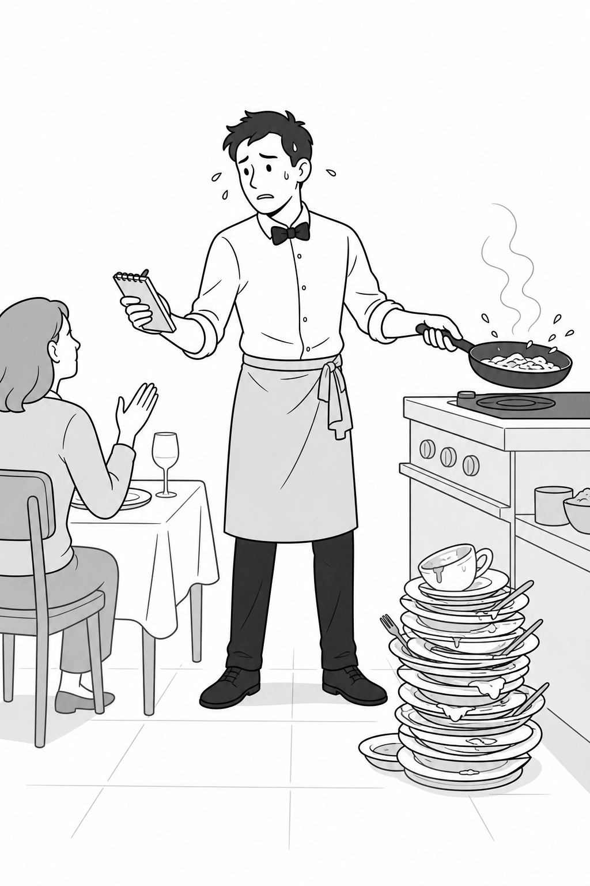
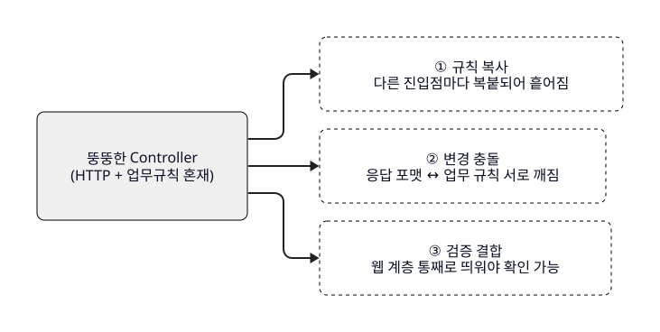
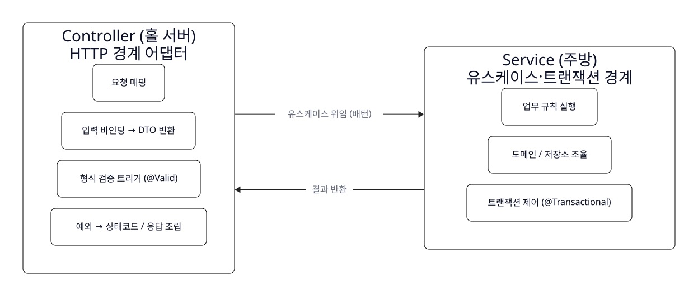
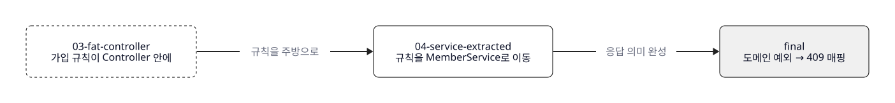
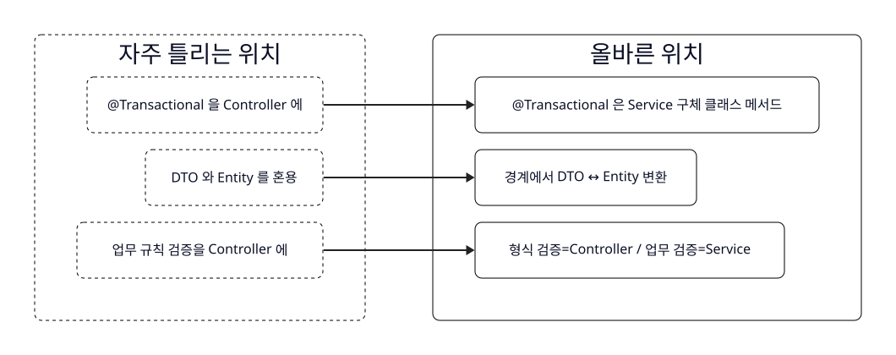
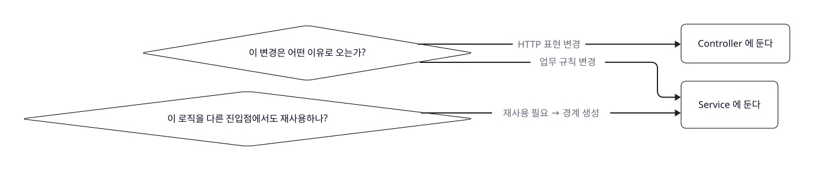

<!--
meta:
  course: spring-mvc-offline-2026 (오프라인 현장 실습 수업, 180분 / 편 개념 없음)
  lesson: L02 / THEORY / 30분 (판서 수업, slide_mode: summary)
  title: Controller와 Service의 책임 경계
  derived_from: courses/spring-mvc-2026/scripts/L02.md (촬영판 — 서사·17주장·출처 재사용, 발화 확장 + 오프라인 판서 전환)
  learning_goal: Controller와 Service의 책임을 구분할 수 있다. (goal ref 1)
  narrative: content-rules (b) — 문제 상황 → 깨지는 지점 → 분리 근거(변경 이유) → 책임표 → 트랜잭션 경계 → 코드 관찰 → 흔한 오분류 → 언제 피할지 → L03 실습 예고
  central_metaphor: 홀 서버(웨이터)=Controller ↔ 주방(셰프)=Service. DTO=주문서 / Entity=식재료 / 트랜잭션=한 티켓 all-or-nothing
  metaphor_drop_point: "Service를 '데이터베이스'로 오해시키는 지점" — 주방(조리)과 저장창고(Repository/DB)를 구분할 때 비유를 버리고 계층으로 직설 (컷 5 끝, [비유 이탈 — 직설])
  used_claims: [S1-1, S1-2, S1-3, S1-4, S2-1, S3-1, S3-2, S4-1, S4-2, S4-3, S4-4, S5-1, S6-1, S6-2, S6-3, S7-1, S7-2]
  softened_unverified: [S1-3(웹계층 띄워야 검증-구조사실만/정량금지), S1-4("흔히 ~라 부른다"), S6-2(보안위험 부연 "~할 수 있다"), S7-1("실무 논쟁이 있다")]
  version_specific_cited: [S4-2 → Spring Framework Reference, Web MVC Validation (Spring 6.1 메서드 검증 주의)]
  cross_lesson: L01(요청 흐름)와 중복 금지 — Controller↔Service 배턴 지점만 확대. L03(LAB) 실습 예고 다리 포함(컷 6·컷 8).
  offline_specifics:
    - 판서 수업 — 컷 후보 8개(## 컷 N 후보), 각 컷 = 판서슬라이드 한 컷 대응(summary, 컷당 한 줄)
    - [판서: ...] = 강사가 칠판/판서보드에 손으로 채울 여백 지시(비발화). [문답: ...] = 학생에게 던지는 질문(비발화 메모, 실제 던질 발화는 본문에)
    - 코드 관찰(컷 6): 반입 코드 final/ read-only 화면 관찰 — 빌드·타이핑 없음. 직접 구현은 L03(LAB)에서.
    - 관찰 대상: courses/spring-mvc-2026/code/L04 (03-fat-controller → 04-service-extracted → final), read_only
  budget: 발화 20분 상한 목표 5,000~6,000자(공백 제외). [판서:]/[문답:]/시드/이미지/SVG 라인 = 자수 예산 불포함.
  seed_blocks: 비유 ×1(컷1), IMAGE PROMPT ×1(컷1 ol2-fat-controller.png → id ol2-img1), d2 ×7(컷2 깨지는3 / 컷3 변경이유 / 컷4 책임대조 / 컷5 계층흐름 / 컷6 코드이동 / 컷7 오분류 / 컷8 판단질문 → ol2-d1~d7.svg 병기). 스타일: pub-d2-diagram 3색 모노톤.
-->

# L02 — Controller와 Service의 책임 경계 (오프라인 판서 원고)

> 대상: Spring Boot로 CRUD API를 만들어 본 경험자 / DispatcherServlet 내부는 L01에서 다룸.
> 형식: 판서 수업 30분(발화 ~20분 + 판서·문답 ~10분). 컷 8개 = 판서슬라이드 summary 컷 대응.

---

## 컷 1 후보 — "동작은 하는데 자꾸 손이 가는 컨트롤러"

[판서: 슬라이드는 제목 한 줄만. 칠판 왼쪽에 세로로 "받기 / 확인 / 판단 / 저장 / 응답" 다섯 단어를 위→아래로 적고, 그 다섯을 큰 중괄호로 묶어 "메서드 하나"라고 표시. 이게 오늘 부술 그림.]

여러분 모두 Spring Boot로 CRUD API를 만들어 봤죠. 그러면 이런 컨트롤러를 분명히 써 봤을 겁니다. 메서드 하나 안에서 파라미터를 꺼내고, 값이 이상한지 확인하고, 업무 규칙을 판단하고, 저장소를 호출하고, 응답까지 조립합니다. 잘 돌아갑니다. 테스트도 통과하고요. 그런데 프로젝트가 커질수록 이상하게 그 메서드에만 자꾸 손이 갑니다. 오늘은 그게 왜 그런지, 그리고 어떻게 그 손 가는 걸 멈추는지를 다룹니다.

이렇게 컨트롤러 하나가 모든 일을 떠안은 모양을 현장에서는 흔히 "뚱뚱한 컨트롤러"라고 부릅니다. (S1-4) 미리 말하는데, 이건 학계 용어나 공식 명칭이 아니라 개발자들끼리 쓰는 통칭입니다. 그러니 오늘 목표는 이 이름을 외우는 게 아닙니다. 목표는 딱 하나예요. **무엇이 컨트롤러의 일이고 무엇이 아닌지, 그 경계를 스스로 판단할 수 있게 되는 것.** 그리고 오늘 30분 뒤, 다음 시간에는 여러분이 직접 이 경계를 코드로 그어 보게 됩니다. 오늘은 그 판단 기준을 손에 쥐는 시간입니다.

[문답: "혹시 컨트롤러 메서드가 50줄, 100줄 넘어가서 스크롤하며 고쳐 본 분?" — 손 들게 하고 공감 형성. 대부분 든다.]

경계를 식당 하나로 비유하겠습니다. 오늘 이 비유를 끝까지 끌고 갈 겁니다. 손님을 응대하는 **홀 서버**와, 안쪽에서 요리하는 **주방**. 뚱뚱한 컨트롤러는, 홀 서버가 주문도 받고 요리까지 직접 하겠다고 나선 식당입니다. 테이블이 하나면 그래도 됩니다. 문제는 언제나 그 다음이에요.

[비유: Controller↔Service 책임 경계 ↔ 식당 홀 서버(웨이터)↔주방(셰프) — 홀은 주문 응대·전달(HTTP 경계), 주방은 조리(업무 로직)로 역할이 갈릴 때 성립. DTO=주문서, Entity=식재료, 트랜잭션=한 티켓 all-or-nothing. 성립 한계: 주방을 '저장창고(Repository/DB)'로 보면 깨지므로 컷 5에서 그 지점의 비유를 버린다.]



---

## 컷 2 후보 — 경계가 없으면 무엇이 무너지나 (3가지)

[판서: 슬라이드엔 "경계가 없을 때" 한 줄. 칠판에 ①②③ 세로로 번호만 미리 적어두고, 설명하며 각 옆에 키워드 판서 — ① 복사 ② 충돌 ③ 검증. 학생이 셋을 받아 적을 여백 확보.]

```d2
# 시드: 경계 없을 때 깨지는 3가지 (concept_model service=Service Layer가 없앨 중복 / SRP 변경격리 근거)
direction: right
classes: {
  input: { shape: rectangle; style: { fill: "#f0f0f0"; stroke: black; stroke-width: 1; border-radius: 8 } }
  problem: { shape: rectangle; style: { fill: white; stroke: black; stroke-width: 1; border-radius: 8; stroke-dash: 4 } }
}
fat: "뚱뚱한 Controller\n(HTTP + 업무규칙 혼재)" { class: input }
b1: "① 규칙 복사\n다른 진입점마다 복붙되어 흩어짐" { class: problem }
b2: "② 변경 충돌\n응답 포맷 ↔ 업무 규칙 서로 깨짐" { class: problem }
b3: "③ 검증 결합\n웹 계층 통째로 띄워야 확인 가능" { class: problem }
fat -> b1: { style.stroke: "#222222" }
fat -> b2: { style.stroke: "#222222" }
fat -> b3: { style.stroke: "#222222" }
```



경계를 안 그으면 세 가지가 무너집니다. 하나씩 보죠.

**첫째, 규칙이 복사됩니다.** 예를 들어 회원 가입할 때 "이미 가입된 이메일인지" 확인하는 규칙이 있다고 합시다. 이 규칙을, 웹 가입 말고 관리자 배치에서도 써야 하고, 엑셀 일괄 등록에서도 써야 한다고 해봐요. 규칙이 컨트롤러 안에 박혀 있으면 어떻게 되죠? 그 코드를 복붙해서 세 군데에 흩뿌리게 됩니다. 그리고 규칙이 바뀌는 날, 세 군데를 다 찾아 고쳐야 하는데 하나를 빠뜨리죠. Martin Fowler는 바로 이 공통 업무 로직을 한곳에 모아서 여러 진입점에 걸친 중복을 없애는 자리를 "서비스 계층"이라고 불렀습니다. (S1-1 — Fowler, *PoEAA*, "Service Layer")

**둘째, 변경이 서로를 넘어뜨립니다.** HTTP를 다루는 코드와 업무 규칙이 한 메서드에 섞여 있으면, 응답 포맷 하나 바꾸려다가 옆에 있던 가입 규칙을 실수로 건드리고, 규칙을 손보다가 엔드포인트 경로를 깨뜨립니다. Robert C. Martin의 단일 책임 원칙이 정확히 이 얘기예요. "한 모듈은 바뀌어야 할 이유가 오직 하나여야 한다." (S1-2 — R.C. Martin, "SRP", 2014) 이유가 둘이면, 한 이유로 손댈 때마다 다른 이유가 인질로 잡히는 거죠.

**셋째, 검증하려면 웹을 통째로 띄워야 합니다.** 가입 규칙이 컨트롤러 안에 있으면, 그 규칙 하나가 맞는지 확인하려고 HTTP 계층 전체를 세워야 합니다. 규칙이 서비스의 평범한 자바 객체에 있으면 웹 없이 그것만 딱 검증할 수 있고요. (S1-3) 빠르다 느리다의 문제가 아니라, 검증하는 데 무엇까지 딸려 오느냐의 문제입니다.

식당으로 돌아가면, 홀 서버가 요리까지 하는 식당은 그 사람이 화장실만 가도 요리가 멈춥니다. Fowler의 표현으로는, 애플리케이션의 "경계"가 웹 프레임워크에 통째로 묶여버린 거예요. (S2-1 — Fowler, "Service Layer") 웹이 아닌 다른 입구로는 같은 일을 재사용할 수가 없게 됩니다.

---

## 컷 3 후보 — 나누는 기준: 줄 수가 아니라 "변경 이유"

[판서: 슬라이드 "기준: 줄 수 ❌ / 변경 이유 ⭕" 한 줄. 칠판에 두 개의 화살표를 그려 판서 — 왼쪽 "API 스펙 → Controller", 오른쪽 "기획·정책 → Service". 두 화살표가 서로 다른 사람(이해관계자)에서 온다는 걸 사람 아이콘으로 강조.]

```d2
# 시드: 분리 기준 = 변경 이유(출처가 다른 두 변경) (concept_model SRP / controller vs service 바뀌는 이유)
direction: right
classes: {
  input: { shape: rectangle; style: { fill: "#f0f0f0"; stroke: black; stroke-width: 1; border-radius: 8 } }
  proc: { shape: rectangle; style: { fill: white; stroke: black; stroke-width: 1; border-radius: 8 } }
}
spec: "API 스펙 변경\n경로·상태코드·응답 포맷" { class: input }
plan: "기획·정책 변경\n규칙·계산·트랜잭션 범위" { class: input }
controller: "Controller\n(HTTP 표현)" { class: proc }
service: "Service\n(업무 규칙)" { class: proc }
spec -> controller: "이 이유로만 바뀜" { style.stroke: "#222222" }
plan -> service: "이 이유로만 바뀜" { style.stroke: "#222222" }
note: "두 변경을 한 모듈에 두면\n한쪽이 다른 쪽을 인질로 잡음" { shape: text }
```


여기서 아주 흔한 오해 하나를 끊고 가겠습니다. "컨트롤러가 길어지면 서비스로 뺀다." 이거, 틀렸습니다. 정확히는 기준이 잘못됐어요. 나누는 기준은 코드가 길어서가 **아닙니다.** 기준은 **무엇이, 어떤 이유로 바뀌는가**입니다.

생각해 보세요. HTTP 표현이 바뀌는 이유는 어디서 옵니까? 엔드포인트 경로를 `/members`에서 `/api/v2/members`로 바꾸자, 성공 시 200 말고 201을 주자, 응답 필드를 하나 더 넣자. 이런 건 전부 API 스펙 쪽에서 옵니다. 반면 업무 규칙이 바뀌는 이유는? "이제 이메일 중복 말고 휴대폰 중복도 막자", "가입 시 포인트 1000점을 주자". 이건 기획에서 옵니다. 출처가 완전히 다르죠.

[문답: "그럼 이 두 변경을 한 메서드에 같이 두면 무슨 일이 생길까요?" — 잠깐 기다렸다가 받기.]

출처가 다른 두 변경을 한 모듈에 두면, 한쪽이 다른 쪽을 인질로 잡습니다. 기획자가 규칙 하나 바꿔달라고 했을 뿐인데 API 스펙이 흔들릴 위험을 지는 거예요. Martin은 이 원칙을 두고 "결국 사람에 관한 것"이라고 못박았습니다 — 서로 다른 이해관계자의 변경 요구가 서로를 깨뜨리지 않게 격리하라는 뜻입니다. (S3-1 — R.C. Martin, "SRP", 2014)

단, 오해를 하나 더 막겠습니다. "그럼 로직은 다 서비스로 옮기면 끝"이냐? 그것도 아닙니다. 모든 로직을 서비스에 몰아넣고 도메인 객체를 게터·세터만 있는 빈 껍데기로 두면, 그건 "빈혈 도메인 모델"이라는 또 다른 안티패턴이 됩니다. (S3-2 — Fowler, "AnemicDomainModel") 그 깊은 이야기는 뒤 과정에서 다루고, 오늘은 딱 이 한 문장만 붙잡으세요. **"서비스는 로직을 아무거나 던져 넣는 만능 창고가 아니다."**

---

## 컷 4 후보 — 두 계층의 책임표 (홀 서버 vs 주방)

[판서: 슬라이드는 표 골격만(칸 비워둠). 강사가 표의 각 칸을 말하며 채워 넣는 게 이 컷의 핵심. 왼쪽 열 = 홀 서버(Controller), 오른쪽 열 = 주방(Service). 학생도 같이 표를 그려 채우게 유도.]

```d2
# 시드: 책임 대조 구도 (Controller vs Service). 01_concept_model relationships delegates_use_case / returns_result 발췌
direction: right
classes: {
  proc: { shape: rectangle; style: { fill: white; stroke: black; stroke-width: 1; border-radius: 8 } }
}
controller: "Controller (홀 서버)\nHTTP 경계 어댑터" {
  class: proc
  r1: "요청 매핑" { class: proc }
  r2: "입력 바인딩 → DTO 변환" { class: proc }
  r3: "형식 검증 트리거 (@Valid)" { class: proc }
  r4: "예외 → 상태코드 / 응답 조립" { class: proc }
}
service: "Service (주방)\n유스케이스·트랜잭션 경계" {
  class: proc
  s1: "업무 규칙 실행" { class: proc }
  s2: "도메인 / 저장소 조율" { class: proc }
  s3: "트랜잭션 제어 (@Transactional)" { class: proc }
}
controller -> service: "유스케이스 위임 (배턴)" { style.stroke: "#222222" }
service -> controller: "결과 반환" { style.stroke: "#222222" }
```



이제 경계를 표로 정리하겠습니다. 이 표를 지금 같이 그려두면, 앞으로 코드 짤 때 계속 꺼내 쓰게 됩니다.

| | Controller (홀 서버) | Service (주방) |
|---|---|---|
| 한 문장 | HTTP와 애플리케이션 사이의 어댑터 | 유스케이스 + 트랜잭션 경계 |
| 하는 일 | 매핑·바인딩·형식 검증 트리거·예외→상태코드·응답 조립 | 업무 규칙 실행·도메인/저장소 조율·트랜잭션 제어 |
| 다루는 것 | 주문서(요청 DTO) ↔ 상태 전달 | 레시피(업무 로직), 티켓 하나 = 전부 아니면 취소 |
| 바뀌는 이유 | 경로·상태코드·응답 포맷 | 정책·계산·트랜잭션 범위 |

**Controller는 HTTP 경계의 어댑터입니다.** 표 왼쪽 열이 전부 여기예요. 손님 말을 알아듣고, 메뉴에 있는 주문인지 형식을 확인하고, 음식이 나가면 "나왔습니다" 하고 상태를 전달하는 홀 서버. Spring 공식 레퍼런스도 컨트롤러를 "HTTP 요청과 비즈니스 로직 사이의 다리"라고 설명합니다. (S4-1 — Spring Framework Reference, Web MVC "Annotated Controllers", Spring 6.x / Boot 3.4.x)

검증 얘기를 한 겹만 짚겠습니다. `@Valid` 같은 형식·제약 검증은 **컨트롤러 경계에서** 트리거됩니다. 참고로 이건 버전을 좀 타요. Spring 6.1부터는 내장 메서드 검증을 쓰려면 클래스 레벨의 `@Validated`를 빼야 하는 등 동작이 갈리니, 실무에서 쓸 땐 반드시 그 버전의 공식 문서를 확인하세요. (S4-2 — Spring Framework Reference, Web MVC "Validation") 여기서 진짜 중요한 건 이겁니다. **컨트롤러가 하는 검증은 "형식이 맞는가"이지 "업무적으로 되는가"가 아니다.** 홀 서버는 주문서 양식이 맞는지는 보지만, 재료가 남았는지는 모릅니다.

**Service는 유스케이스이자 트랜잭션 경계입니다.** Fowler의 정의로, 서비스 계층은 "업무 로직을 캡슐화하고, 트랜잭션을 제어하며, 응답을 조율"합니다. (S4-3 — Fowler, "Service Layer") 주방이 실제 요리를 하는 자리죠.

한 요청이 이 둘을 지나는 지점만 딱 짚겠습니다. 컨트롤러가 요청을 받아 입력 DTO로 바꿔서 **서비스의 유스케이스 메서드에 배턴을 넘기고, 서비스가 결과를 돌려주면 컨트롤러가 그걸 응답 표현으로 바꿉니다.** 이 배턴을 주고받는 한 지점이 오늘의 무대예요. DispatcherServlet이 여기까지 어떻게 오는지는 지난 L01에서 이미 봤으니 반복하지 않겠습니다. (S5-1)

---

## 컷 5 후보 — 트랜잭션 경계는 왜 하필 Service인가 (오늘의 핵심)

[판서: 슬라이드 "트랜잭션 경계 = 유스케이스 경계 = Service" 한 줄. 칠판엔 주방 티켓 하나 그리고, 그 안에 "스테이크 + 사이드"를 묶어 "둘 다 나가거나 / 둘 다 취소"라고 크게. all-or-nothing을 시각적으로.]

오늘 이 수업에서 딱 한 장만 가져가라면 이겁니다. 주방 티켓을 떠올려 보세요. 스테이크랑 사이드가 한 티켓에 묶여 있으면, 둘 다 나가거나 둘 다 안 나갑니다. 스테이크만 나오고 사이드는 "아 그건 취소됐어요" 하는 반쪽짜리 서빙은 없죠. 하나의 업무 단위가 전부-아니면-전무로 처리되는 것, 이게 트랜잭션이고, 그 단위를 정의하는 자리가 바로 서비스의 유스케이스 메서드입니다.

Spring 팀도 이걸 아주 명시적으로 권장합니다. "`@Transactional`은 인터페이스가 아니라 구체 클래스의 메서드에 붙여라." (S4-4 — Spring Framework Reference, Data Access "Using @Transactional") 실무에서 그 구체 클래스가 바로 서비스죠. 그래서 정리하면 이렇게 됩니다. **트랜잭션 경계 = 유스케이스 경계 = 서비스.** 이걸 컨트롤러에 두면 안 되는 이유가 여기서 나옵니다 — 트랜잭션은 업무 단위인데, 컨트롤러는 업무 단위를 정의하는 자리가 아니거든요.

[비유 이탈 — 직설] 자, 여기서 오늘 끌고 온 식당 비유 하나를 일부러 버리겠습니다. 주의하세요. 주방을 "재료 창고"나 "데이터베이스"로 생각하면 안 됩니다. 주방은 **조리하는 곳**, 즉 업무를 조율하는 유스케이스입니다. 재료를 넣고 꺼내는 저장창고는 **완전히 별개의 계층인 Repository**이고, 그 뒤에 DB가 있어요. 서비스가 저장소를 호출은 하지만, 서비스가 곧 저장소는 아닙니다. 이 층이 흐려지는 순간, 뒤에서 볼 오분류가 시작됩니다.

```d2
# 시드: 계층 흐름. 01_concept_model relationships delegates_use_case / coordinates / owns 발췌
direction: right
classes: {
  input: { shape: rectangle; style: { fill: "#f0f0f0"; stroke: black; stroke-width: 1; border-radius: 8 } }
  proc: { shape: rectangle; style: { fill: white; stroke: black; stroke-width: 1; border-radius: 8 } }
  db: { shape: cylinder; style: { fill: "#eeeeee"; stroke: black; stroke-width: 1 } }
}
client: "HTTP 클라이언트" { class: input }
controller: "Controller\n(HTTP 경계)" { class: proc }
service: "Service\n(유스케이스·트랜잭션)" { class: proc }
repository: "Repository\n(저장 접근)" { class: proc }
db: "DB\n(저장소)" { class: db }
tx: "트랜잭션 경계\nall-or-nothing" { class: proc }
client -> controller: "요청" { style.stroke: "#222222" }
controller -> service: "입력 DTO 전달" { style.stroke: "#222222" }
service -> repository: "조율 (coordinates)" { style.stroke: "#222222" }
repository -> db: "영속성 접근" { style.stroke: "#222222" }
service -> controller: "결과 반환" { style.stroke: "#222222" }
controller -> client: "응답 표현" { style.stroke: "#222222" }
service -> tx: "@Transactional 소유" { style.stroke: "#222222" }
```


```
Controller → Service → Repository → DB
 (HTTP경계)  (유스케이스·트랜잭션)  (저장 접근)  (저장소)
```

[판서: 위 4단 계층을 칠판에 왼→오로 크게 쓰고, Service 아래에만 밑줄 두 줄 그으며 "트랜잭션은 여기". 학생이 이 한 줄을 노트에 옮기게.]

---

## 컷 6 후보 — 코드로 확인 (관찰: 뚱뚱한 → 분리 → 완성)

[판서: 슬라이드 "말한 경계를, 실제 코드에서" 한 줄. 이 컷은 IDE 화면(read-only) 관찰. 빌드·실행·타이핑 없음 — 직접 구현은 다음 시간(L03). 강사는 세 파일을 순서대로 띄워 "코드가 자리를 옮기는 것"만 보여준다.]

```d2
# 시드: 코드 이동 관찰 — 뚱뚱한 Controller → Service 분리 → 도메인 예외로 응답 매핑
direction: right
classes: {
  before: { shape: rectangle; style: { fill: white; stroke: black; stroke-width: 1; border-radius: 8; stroke-dash: 4 } }
  proc: { shape: rectangle; style: { fill: white; stroke: black; stroke-width: 1; border-radius: 8 } }
  input: { shape: rectangle; style: { fill: "#f0f0f0"; stroke: black; stroke-width: 1; border-radius: 8 } }
}
s3: "03-fat-controller\n가입 규칙이 Controller 안에" { class: before }
s4: "04-service-extracted\n규칙을 MemberService로 이동" { class: proc }
s5: "final\n도메인 예외 → 409 매핑" { class: input }
s3 -> s4: "규칙을 주방으로" { style.stroke: "#222222" }
s4 -> s5: "응답 의미 완성" { style.stroke: "#222222" }
```



지금까지 말로 그린 경계를, 실제 코드에서 눈으로 한번 확인하겠습니다. 오늘은 관찰만 합니다. 타이핑도 실행도 안 해요. **직접 만드는 건 다음 시간, 여러분 손으로 합니다.** 지금은 "아, 코드가 자리를 옮긴다는 게 이거구나"만 느끼면 됩니다.

먼저 이 화면. `03-fat-controller`, 뚱뚱한 컨트롤러입니다. `signUp` 메서드 안을 보세요. `if (memberRepository.existsByEmail(...))` — 이미 가입된 이메일인지 확인하는 **가입 규칙이 컨트롤러 안에 직접 들어와 있습니다.** 홀 서버가 주방 일까지 하는 상태죠. 동작은 합니다. 하지만 이 규칙을 다른 데서 또 쓰려면? 복붙입니다. 아까 컷 2에서 말한 첫 번째 문제 그대로예요.

[문답: "이 중복 검사 코드, 컨트롤러에 있는 게 지금 편해 보이나요, 불안해 보이나요?" — 반응 받고 다음으로.]

다음 화면, `04-service-extracted`. 달라진 걸 찾아보세요. 컨트롤러에 있던 그 `if` 검사가 사라졌습니다. 대신 `MemberService`라는 새 파일이 생겼고, 규칙이 그 안의 `signUp` 메서드로 옮겨갔어요. 컨트롤러는 이제 `memberService.signUp(request)` 한 줄로 주방에 배턴을 넘길 뿐입니다. 규칙을 판단하는 건 주방이 하고요. 컷 4의 표가 코드로 그대로 나타난 겁니다.

마지막 화면, `final`. 여기서 한 걸음 더 갑니다. 서비스는 중복일 때 그냥 범용 예외를 던지는 게 아니라 `DuplicateEmailException`이라는 도메인 예외를 던집니다. 그리고 컨트롤러의 `@ExceptionHandler`가 그 예외를 잡아서 **409 Conflict 상태 코드로 매핑**하죠. 보세요 — 예외를 "던지는" 건 주방(서비스)이고, 그걸 "손님에게 어떤 말로 전할지"(상태 코드)는 홀 서버(컨트롤러)가 정합니다. 업무 판단과 HTTP 표현이 정확히 갈라져 있죠. 이게 오늘 우리가 표로 그린 경계의 완성형입니다.

[판서: 세 파일명을 칠판에 화살표로 연결 — fat → 분리 → 예외매핑. 각 단계 아래 "무엇이 어디로 갔나"만 한 단어씩. 이게 다음 시간 실습의 뼈대라고 예고.]

---

## 컷 7 후보 — 흔히 헷갈리는 세 지점

[판서: 슬라이드 "자주 틀리는 3가지" 한 줄. 칠판을 세로로 반 나눠 왼쪽 "❌ 잘못 두는 곳" / 오른쪽 "⭕ 맞는 곳". 셋을 짝지어 판서하며 학생이 자기 코드에서 짚어보게.]

```d2
# 시드: 흔한 오분류 3가지 — 잘못된 위치→올바른 위치 (concept_model transaction-boundary / dto / service)
direction: right
classes: {
  problem: { shape: rectangle; style: { fill: white; stroke: black; stroke-width: 1; border-radius: 8; stroke-dash: 4 } }
  proc: { shape: rectangle; style: { fill: white; stroke: black; stroke-width: 1; border-radius: 8 } }
}
wrong: "자주 틀리는 위치" {
  class: problem
  w1: "@Transactional 을 Controller 에" { class: problem }
  w2: "DTO 와 Entity 를 혼용" { class: problem }
  w3: "업무 규칙 검증을 Controller 에" { class: problem }
}
right: "올바른 위치" {
  class: proc
  r1: "@Transactional 은 Service 구체 클래스 메서드" { class: proc }
  r2: "경계에서 DTO ↔ Entity 변환" { class: proc }
  r3: "형식 검증=Controller / 업무 검증=Service" { class: proc }
}
wrong.w1 -> right.r1: { style.stroke: "#222222" }
wrong.w2 -> right.r2: { style.stroke: "#222222" }
wrong.w3 -> right.r3: { style.stroke: "#222222" }
```



경계를 배웠으니, 이제 그 경계를 헷갈리는 지점 세 개를 짚겠습니다. 이건 여러분이 다음 시간에, 그리고 실무에서 실제로 밟게 될 지뢰들이에요.

**첫째, 트랜잭션을 웹 계층에 둡니다.** `@Transactional`을 컨트롤러에 붙이거나, 컨트롤러에서 저장소를 여러 번 이어 호출해서 업무 단위 경계를 웹에 만드는 것. 방금 컷 5에서 봤듯 권장은 서비스 구체 클래스 메서드입니다. (S6-1 — Spring Reference, "Using @Transactional")

**둘째, 주문서와 식재료를 같은 것으로 씁니다 — DTO와 Entity 혼용.** 요청·응답용 DTO와, 도메인·영속 Entity를 구분 없이 하나로 씁니다. Fowler의 정의로 DTO는 "프로세스 경계를 넘어 데이터를 나르는 객체"로 목적 자체가 달라요. (S6-2 — Fowler, *PoEAA*, "Data Transfer Object") 주문서엔 "스테이크 미디엄"이라고 적지, 소 한 마리가 통째로 적히진 않죠. 엔티티를 그대로 응답에 노출하면 직렬화·바인딩 관심사가 도메인으로 새거나, 안 보여줘도 될 필드가 과하게 드러날 수도 있습니다. 그래서 경계에서 데이터 모양을 바꾸는 변환, 이게 컨트롤러의 일입니다. 아까 final 코드에서 `SignUpRequest`, `SignUpResponse`가 따로 있던 게 이겁니다.

**셋째, 업무 규칙 검증을 형식 검증과 같은 층으로 봅니다.** `@NotBlank`, `@Min` 같은 형식 검증은 컨트롤러 경계지만, "이미 가입된 이메일인가", "잔액이 부족한가" 같은 **업무 규칙 검증은 서비스**입니다. (S6-3) 홀 서버는 "메뉴에 있는 주문인지"는 확인하지만, "재료가 남았는지"는 주방이 압니다. 이 둘을 한 층에서 처리하려 들면 경계가 무너져요.

---

## 컷 8 후보 — 언제 이 분리가 과한가 + 다음 시간 예고

[판서: 슬라이드 "항상 나눠야 하나?" 한 줄. 마무리 판서로 칠판에 두 개의 질문만 크게 남기고 수업을 닫는다. 학생이 이 두 줄을 노트 맨 끝에 적게.]

```d2
# 시드: 배치 판단 두 질문 (concept_model SRP=변경이유 / Service Layer=재사용 경계)
direction: right
classes: {
  decision: { shape: diamond; style: { fill: white; stroke: black; stroke-width: 1 } }
  proc: { shape: rectangle; style: { fill: white; stroke: black; stroke-width: 1; border-radius: 8 } }
}
q1: "이 변경은 어떤 이유로 오는가?" { class: decision }
q2: "이 로직을 다른 진입점에서도 재사용하나?" { class: decision }
controller: "Controller 에 둔다" { class: proc }
service: "Service 에 둔다" { class: proc }
q1 -> controller: "HTTP 표현 변경" { style.stroke: "#222222" }
q1 -> service: "업무 규칙 변경" { style.stroke: "#222222" }
q2 -> service: "재사용 필요 → 경계 생성" { style.stroke: "#222222" }
```



마지막 질문. 그럼 무조건, 항상 서비스를 만들어야 할까요? 아닙니다. 서비스가 저장소를 그냥 1:1로 넘기기만 하는, 아무 규칙도 없는 순수 통과형 CRUD에서는, 로직 하나 없는 서비스가 상용구만 늘린다는 **실무 논쟁이 있습니다.** (S7-1) 이건 정답이 정해진 규칙이 아니라 판단의 문제예요. 그러니 "서비스를 무조건 없애라"도 아니고 "무조건 만들어라"도 아닙니다. 이렇게 물어야 합니다 — **"이 계층은 대체 무엇을 위해 있는가?"**

그래서 오늘의 결론은 외울 규칙 목록이 아니라, 딱 두 개의 질문입니다. (S7-2) 새 코드를 짜다가 "이걸 컨트롤러에 둘까 서비스에 둘까" 망설여지면, 이 둘을 던지세요.

- **"이 변경은 어떤 이유로 오는가?"** — HTTP 표현이 바뀌는 거면 Controller, 업무 규칙이 바뀌는 거면 Service. (SRP)
- **"이 로직을 다른 진입점에서도 재사용해야 하는가?"** — 재사용 경계가 필요하면 Service. (Service Layer)

이 두 질문에 답할 수 있으면, 여러분은 새 코드를 어디에 둘지 스스로 판단할 수 있습니다. 그게 오늘의 목표였어요. 규칙을 외운 게 아니라, 판단 기준을 손에 쥔 겁니다.

[문답: "지금 자기 프로젝트 컨트롤러 하나 떠올려서 — 이 두 질문 통과하나요? 통과 못 하는 코드 한 줄만 각자 찾아보세요." — 다음 시간으로 자연스럽게 넘기는 다리.]

그리고 다음 시간, L03입니다. 오늘 말과 표로 그린 이 경계를, **이번엔 여러분이 직접 코드로 긋습니다.** 회원 가입 API를 만들면서, 방금 관찰한 것처럼 일부러 규칙을 컨트롤러에 뭉쳐 뚱뚱하게 만들었다가, 그걸 서비스로 분리하고, 도메인 예외로 응답까지 완성하는 과정을 여러분 손으로 타이핑하고 실행합니다. 오늘 머리로 이해한 경계가, 다음 시간엔 여러분 손끝에서 코드가 자리를 옮기는 것으로 확인될 겁니다. 오늘 그린 이 두 질문, 지우지 말고 그대로 가져오세요.
